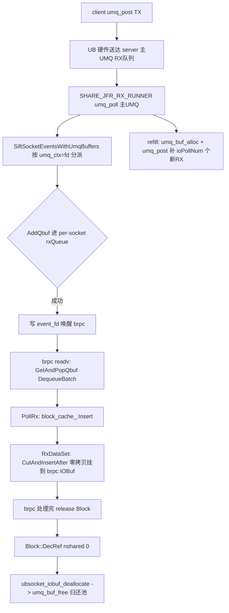

# UBSocket RX 内存泄露分析 (server 端)

> **场景**:630 个 client 并行持续向 server 发送 1MB 包,约 10 分钟后 server 报错:
> `expand mem size max: 5368709120, now expand mem size 5364514816, expand buf pool need: 35651584, expand failed`
>
> 本文从 server 收发流程往下逐层分析 umq 适配层代码,定位 buffer 不回流的泄露路径。

## 1. 现象解读

报错来自 umq 内存池扩容逻辑。UMQ 池**只涨不缩**的唯一原因:`umq_buf_alloc`(从池分配)多于 `umq_buf_free`(归还池),即分配出的 buffer 没有回流到池的 free list。

- `5368709120` = 5GB(池上限,对应 `UBSOCKET_POOL_MAX_SIZE` ≈ 5120MB)
- `now 5364514816` ≈ 4.996GB(已用,逼近上限)
- `need 35651584` ≈ 34MB(本次扩容需求,因已达上限而失败)

5GB 在 10 分钟被打满,说明有 buffer 被分配后**永久丢失**(既没归还池,也没到 brpc 被消费)。下文逐层定位丢失点。

## 2. server 收发数据通路回顾

### 2.1 RX(接收)通路

server 默认 `UBS_ENABLE_SHARE_JFR=true` + `ubsocket_ub_trans_mode=RM_CTP`。RX 由后台 `SHARE_JFR_RX_RUNNER` 线程统一处理:



关键回收点:`Block::DecRef` → `ubsocket_iobuf_deallocate` → `UmqZeroCopyAllocator::deallocate` → `umq_data_to_head` → `umq_buf_free`(`ubsocket_iobuf.h:54-61`、`umq_backend.h:73-85`)。

### 2.2 TX(发送)通路

server 响应:`AllocTxBuf`(`umq_buf_alloc`)→ `PostSend`(`umq_post`)→ TX CQE → `ProcessTxCqe`(`umq_buf_free` + `Block::DecRef`)(`umq_tx_helper.cpp:103-153`)。TX 路径 reclaim 与 post 配对,非本次泄露主因(见 §5.C)。

### 2.3 buffer 布局与回收正确性(排除该路径)

RX buffer 由 `umq_buf_alloc` 带 `UMQ_ALLOC_FLAG_HEAD_ROOM_SIZE, sizeof(Block)` 分配(`umq_conn_helper.cpp:57`)。布局:`[umq_buf_t 头][headroom=sizeof(Block)][buf_data 指向数据区]`。

`BlockCache::Insert` 把 Block 放在 `buf_data - sizeof(Block)`(headroom 起始,`ubsocket_iobuf.h:102`)。`umq_qbuf_base_data_to_head`(`umq_qbuf_pool_base.c:228-247`)按 block 对齐计算 id:

```c
id = (data - data_buffer) / block_size;
```

由于 `sizeof(Block)` ≪ block_size(8K/4K),`buf_data - sizeof(Block)` 与 `buf_data` 落在**同一 block 内**,id 相同。因此 `umq_data_to_head(buf_data - sizeof(Block))` 返回正确 umq_buf_t,`umq_buf_free` 回收正确。

**结论**:`Block::DecRef` 回收路径本身正确——前提是 buffer 能到达 brpc 并被 release。泄露必然发生在 **buffer 到达 brpc 之前丢失** 的环节。

## 3. 主泄露路径:AddQbuf 失败导致 buffer 丢失

### 3.1 runner 无条件补充新 buffer

`UmqShareJfrEpollRunnerOps::ProcessShareJfrEvent`(`umq_share_jfr_epoll_runner_ops.cpp:150-172`):

```cpp
int ioPollNum = pollNum - fcBufCnt;          // 本轮取出的 IO buffer 数
if (ioPollNum != 0) {
    umq_buf_t *rx_buf_list =
        UmqApi::umq_buf_alloc(UmqSetting::GetIOBufSize(), ioPollNum, UMQ_INVALID_HANDLE, &alloc_option);
    if (LIKELY(rx_buf_list != nullptr)) {
        UmqApi::umq_post(main_umq, rx_buf_list, &io_rx_option, &bad_qbuf);  // 投回 RX 队列维持窗口
    }
}
```

**关键**:refill 分配 `ioPollNum` 个新 buffer 投回 RX,**与下文 AddQbuf 是否成功完全无关**——无论分派成功多少,都补等量新 buffer。

### 3.2 分派失败直接 continue 丢弃

`SiftSocketEventsWithUmqBuffers`(`umq_share_jfr_epoll_runner_ops.cpp:247-250`):

```cpp
if (UNLIKELY((((UmqSocket *)socket_ptr.Get())->AddQbuf(buf[i]) != 0))) {
    UBS_VLOG_ERR("async_epoll add qbuf for socket fd: %d failed.\n", socket_fd);
    continue;   // buf[i] 既没 AddQbuf 进队列,也没 umq_buf_free,直接丢失
}
```

### 3.3 AddQbuf 内部失败也不 free

`UmqSocket::AddQbuf`(`umq_socket.cpp:421-435`):

```cpp
UmqBufferReceiveQueue::OpResult enqueue_ret = rxQueue->Enqueue(qbuf);
if (enqueue_ret != UmqBufferReceiveQueue::OpResult::OK) {
    UBS_VLOG_ERR("AddQbuf failed, fd: %d, ret: %d\n", raw_socket_, static_cast<int>(enqueue_ret));
    return UBS_ERROR;   // 没有 umq_buf_free(qbuf)
}
```

### 3.4 队列满的判定:Push 失败不消费 item

`SPSCRingQueue::Push`(`ubsocket_spsc_ring_queue.h:31-42`):

```cpp
bool Push(const T &item) noexcept {
    auto rd = __atomic_load_n(&commit_read_, __ATOMIC_ACQUIRE);
    if (write_index_ - rd >= capacity_) {
        return false;        // 满,返回 false,item 未被消费
    }
    ...
}
```

`UmqBufferReceiveQueue::Enqueue`(`umq_buffer_receive_queue.cpp:78-95`)对 Push 返回值的处理分两条路径:

- **非保序路径**(`use_o3_==false`,`:90-93`):
  ```cpp
  if (!use_o3_) {
      receive_queue->Push(buffer);   // 返回值被忽略!
      return OpResult::OK;           // 即使 Push 失败也返回 OK
  }
  ```
  **静默丢失**——无错误日志,AddQbuf 返回 OK,上层无感知。

- **保序路径**(`use_o3_==true`,默认 RM_CTP 走此路,`EnqueueInOrder:164`):
  ```cpp
  return out_of_order_queue->Push(buffer) == UBS_OK ? OpResult::OK : OpResult::ERROR;
  ```
  ooo 队列满时返回 ERROR → AddQbuf 返回 UBS_ERROR → §3.2 `continue` 丢弃(有错误日志)。

  另外 `EnqueueInOrder` 内部对 `receive_queue->Push` 的返回值同样存在忽略点(`:91`、`:141`、`:201`、`:208`),in-order 数据进 `receive_queue` 满时也会静默丢。

### 3.5 净效果(为何必然涨到 5GB)

每个 SHARE_JFR runner poll 周期,对某个积压 socket:
- 从 RX 窗口取出 N 个 buffer(其中 L 个因队列满 AddQbuf 失败而丢失)
- 补 N 个新 buffer 投回 RX(§3.1,窗口不变)
- L 个丢失 buffer **永不归还池** → 池 free list 缺口 +L

630 client × 1MB(每包切 ~128 个 8K buffer)× 高 QPS,只要 brpc 的 `readv`(`GetAndPopQbuf`/`DequeueBatch`)在某些 socket 上跟不上(bthread 调度抖动、单连接积压、CTP 乱序堆积),per-socket 队列(capacity = `UBS_RX_DEPTH`≈2048)就会满,AddQbuf 持续失败,池稳步增长。10 分钟到 5GB 完全吻合。

## 4. 触发条件与日志核对

泄露只在"per-socket 队列满"时发生,有两条触发线:

| 触发线 | 路径 | 日志 | 概率 |
|--------|------|------|------|
| brpc readv 跟不上 → `receive_queue` 满 | 非保序 `Enqueue` 静默丢 / 保序 in-order Push 忽略返回值 | **无日志** | 高(630 连接高 QPS 下 bthread 调度必然抖动) |
| CTP 保序乱序堆积 → `out_of_order_queue` 满 | `EnqueueInOrder` ooo Push 失败返回 ERROR | `add qbuf for socket fd ... failed` / `AddQbuf failed` | 中(乱序压力) |

日志核对:
```bash
grep -c "add qbuf for socket fd" <log>     # ooo 满次数
grep -c "AddQbuf failed" <log>           # AddQbuf 失败次数
grep "Failed to enqueue" <log>            # Enqueue 失败
```

若 grep 无上述记录,说明走的是**静默路径**(receive_queue 满、Push 返回值被忽略),这本身就是一个严重问题——静默丢 buffer 既难发现也难定位。

## 5. 次要疑似路径(建议一并核查)

### A. HandleSubUmqPollBuffers 对正常数据不处理

`umq_share_jfr_epoll_runner_ops.cpp:79-95`:

```cpp
for (int i = 0; i < pollNum; ++i) {
    if (buf[i]->status != 0) {
        if (buf[i]->status != UMQ_FAKE_BUF_FC_UPDATE) {
            rxOps->HandleErrorRxCqe(buf[i]);   // 错误:处理+free
        } else {
            txOps->WakeUpTx(socketObject);    // 流控:free
        }
        QBUF_LIST_NEXT(buf[i]) = nullptr;
        UmqApi::umq_buf_free(buf[i]);
    }
    // ← status==0 的正常数据 buf:既不 AddQbuf 也不 free!
}
```

共享 JFR 模式下,sub-UMQ RX 中断理论上不应承载正常数据(数据经共享 JFR → `SiftSocketEvents`)。但若 sub-UMQ RX 事件误触发(如 `RUNNER_EVENT_TYPE_SUB_UMQ_RX`),poll 出的 `status==0` 正常 buf 会直接泄漏。属潜在 bug,需确认是否会触发。

### B. BlockCache partial_block 引用计数

`ubsocket_iobuf.h:112-175,203-224`。1MB 消息在 8K block 边界频繁 partial 切分,`IncRef`/`DecRef` 节奏密集:

```cpp
// CutAndInsertAfter,首个 cache block 超过 cut_size:
partial_block_.block = cache_block;
partial_block_.block->cap = partial_block_.offset;
cache_block->IncRef();                 // nshared 1→2(brpc + partial)
```

当前分析下计数平衡(依赖 brpc release 每个 block)。但若 brpc 在异常路径(controller Failed、attachment 未消费、IOBuf 跨请求残留)少一次 DecRef,partial block 永不归零 → 泄漏。1MB 大包放大了 partial 次数,建议用 perf counter 核实 `block_cache_` 残留量(`GetCacheLen()`)与 partial_block 占用。

### C. TX unsignaled wr 缓存

`umq_data_tx_ops.cpp:246-251,658-738`。每 `TX_REPORT_THRESHOLD` 才设 `complete_enable` 产生 CQE,期间 wr 缓存在 `head_buf_`,靠 `FlushTx`(关连接)兜底:

```cpp
if (++unsignaled_wr_num_ >= TX_REPORT_THRESHOLD) {
    buf_pro->flag.bs.complete_enable = 1;
    buf_pro->user_ctx = (uint64_t)QBUF_LIST_FIRST(&head_buf_);  // 缓存段头
    QBUF_LIST_FIRST(&head_buf_) = QBUF_LIST_NEXT(cur_buf);
    unsignaled_wr_num_ = 0;
}
```

持续大流量下阈值会被命中,reclaim 正常,非主因。但若有连接频繁建拆、末批不足阈值即关,残留 unsignaled wr 在 `head_buf_` 会泄漏(`FlushTx` 兜底依赖关连接时机)。

## 6. 修复方案

主泄露根因明确:**队列满时被分派的 buffer 缺少 `umq_buf_free` 兜底,且 refill 无视分派成功率**。按优先级修:

### 方案 1【必须】AddQbuf 失败时 free buffer

`umq_socket.cpp:421-435`,在 `Enqueue` 失败分支补:

```cpp
if (enqueue_ret != UmqBufferReceiveQueue::OpResult::OK) {
    UBS_VLOG_ERR("AddQbuf failed, fd: %d, ret: %d\n", raw_socket_, static_cast<int>(enqueue_ret));
    UmqApi::umq_buf_free(qbuf);   // ← 新增:归还池
    return UBS_ERROR;
}
```

或在调用方 `SiftSocketEventsWithUmqBuffers:247-250` 的 `continue` 前补 `UmqApi::umq_buf_free(buf[i])`。堵住泄漏出口,池自动回流。

### 方案 2【必须】非保序 Enqueue 不再静默丢

`umq_buffer_receive_queue.cpp:90-93`,检查 `receive_queue->Push` 返回值:

```cpp
if (!use_o3_) {
    if (!receive_queue->Push(buffer)) {
        UmqApi::umq_buf_free(buffer);   // ← 新增:满则归还
        return OpResult::ERROR;         // ← 改:返回 ERROR 让上层可见
    }
    return OpResult::OK;
}
```

同时核查 `EnqueueInOrder` 中 `receive_queue->Push` 的忽略点(`:91`、`:141`、`:201`、`:208`)统一加返回值检查。让静默路径变为可观测。

### 方案 3【建议】refill 引入反压

`umq_share_jfr_epoll_runner_ops.cpp:150-172`。方案 1 已让丢失 buffer 回流,池自动平衡,无需改 refill 语义。但若要根治"队列满仍持续补新 buffer"的浪费,可让 AddQbuf 失败的 buffer 直接 free(方案 1 覆盖),或按各 socket 队列剩余容量限流 refill。优先实施方案 1+2,refill 可暂不动。

### 方案 4【建议】队列水位监控

`UmqBufferReceiveQueue` 加高水位计数,触发时打 throttle 日志,便于定位是哪个 socket 积压:

```cpp
// UmqBufferReceiveQueue 增加
uint64_t high_watermark_count_{0};
// Push 失败/接近满时累加并打日志
```

## 7. 验证方法

修复后,用 perf/dfx counter 确认泄露消除:

```bash
# umq 池统计(umq_stats_qbuf_pool_get)观察 normal_pool 在持续负载下是否稳定不再增长
# CLI: ubsocket monitor 输出各 socket 的 rxQueue 水位
```

预期:持续 630 client × 1MB 跑 30 分钟+,`now expand mem size` 稳定在 init_size 附近不再逼近 max。

## 8. 关键代码位置索引

| 位置 | 作用 | 泄露相关性 |
|------|------|-----------|
| `umq_share_jfr_epoll_runner_ops.cpp:150-172` | runner 无条件 refill | 主因(无视分派成功率) |
| `umq_share_jfr_epoll_runner_ops.cpp:247-250` | AddQbuf 失败 continue 不 free | **主泄露出口** |
| `umq_socket.cpp:421-435` | AddQbuf 内部失败不 free | **主泄露出口** |
| `ubsocket_spsc_ring_queue.h:31-42` | Push 满返回 false 不消费 | 满判定基础 |
| `umq_buffer_receive_queue.cpp:90-93` | 非保序 Push 返回值忽略(静默丢) | **静默泄露** |
| `umq_buffer_receive_queue.cpp:164` | 保序 ooo Push 失败返回 ERROR | 有日志泄露 |
| `umq_share_jfr_epoll_runner_ops.cpp:79-95` | HandleSubUmqPollBuffers 不处理正常数据 | 次要潜在 |
| `ubsocket_iobuf.h:112-175,203-224` | BlockCache partial_block 引用计数 | 次要(依赖 brpc release) |
| `umq_data_tx_ops.cpp:246-251,658-738` | TX unsignaled wr 缓存 | 次要(关连接兜底) |
| `ubsocket_iobuf.h:54-61` | Block::DecRef → ubsocket_iobuf_deallocate | 回收正确(已排除) |
| `umq_qbuf_pool_base.c:228-247` | umq_qbuf_base_data_to_head 对齐计算 | 回收正确(已排除) |

## 参考

- `UBSOCKET-BRPC-UB-TEST-FLOW.ch.md` — brpc ub_test 端到端收发流程
- `UBSOCKET-UMQ-ADAPTER-ANALYSIS.ch.md` — umq 适配层逐文件分析(含 RX/TX 通路、BlockCache、UmqBufferReceiveQueue)
- `UBSOCKET-ARCHITECTURE.ch.md` — ubsocket 整体架构
- `UBSOCKET-CSRC-ANALYSIS.ch.md` — csrc 源码概览
