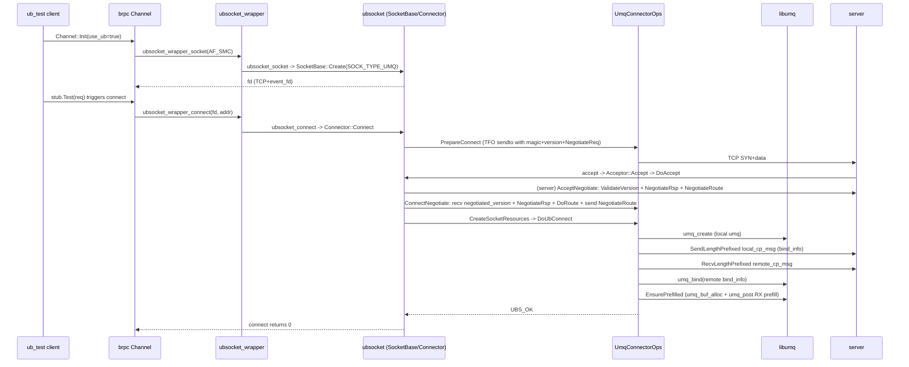
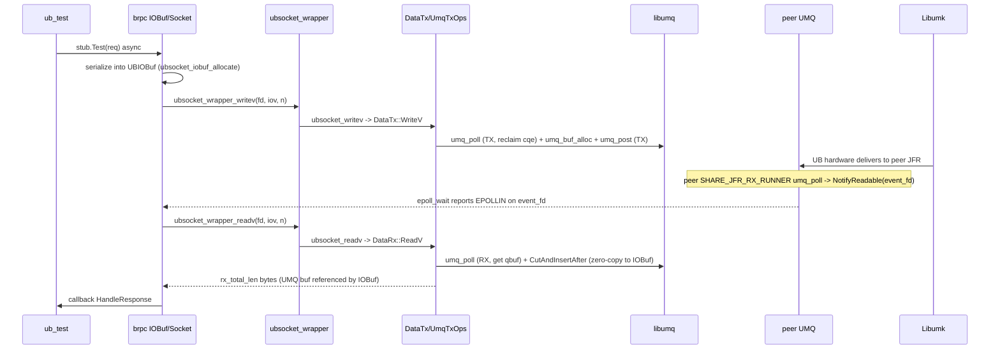

# brpc ub_test 示例调用流程分析

> 本文结合 `brpc/example/ub_test` 中的 client/server 测试代码，讲解 brpc 应用经由 **ubsocket** 与 **umq** 模块完成 UB (Unified Bus) 通信的完整调用流程。
>
> - 示例代码位置: `brpc/example/ub_test/{client.cpp, server.cpp, test.proto}`
> - 本仓相关模块: `src/ubsocket/`(ubsocket)、`src/hcom/umq/`(umq 底层库)

## 1. 示例概览

`ub_test` 是一个基于 brpc 的 RPC 性能测试示例，核心通过两个 gflag 控制是否走 UB 通路：

| gflag | 作用 | 默认 |
|-------|------|------|
| `ubsocket_enable` | 总开关。为 true 时 brpc 所有 socket/epoll 调用劫持到 ubsocket | false |
| `use_ub` | channel/server 选项，标记本连接是否走 UB 协议握手 | false |
| `use_rdma` | 是否走 RDMA 通路 | false |

server 侧 (`server.cpp:179-188`):

```cpp
brpc::ServerOptions options;
options.use_ub = FLAGS_use_ub;        // 标记 listener 接收 UB 连接
server.Start(FLAGS_port, &options);
```

client 侧 (`client.cpp:249-264`):

```cpp
brpc::ChannelOptions options;
options.use_ub = FLAGS_use_ub;        // 标记本次 connect 走 UB 握手
_channel->Init(server.c_str(), &options);
```

`test.proto` 定义了 `PerfTestService.Test` RPC，请求/响应各含一个 `bytes name` 与 `echo_attachment`/`cpu_usage` 字段，用于吞吐与延迟打点。

## 2. 分层架构总览

```
+-----------------------------------------------------------+
|               brpc 应用层 (ub_test client/server)         |
|   Channel::Init / Server::Start / RPC stub::Test          |
+-------------------------+---------------------------------+
| brpc 内部                | ubsocket 集成层 (brpc 侧)      |
| Socket / Acceptor        | ubsocket_wrapper.* (DELEGATE)  |
| EventDispatcher(epoll)   | InitializeUBSocket()           |
| IOBuf (writev/readv)    | UBIOBuf (零拷贝)               |
+-------------------------+---------------------------------+
|                ubsocket 库 (本仓 src/ubsocket/)           |
|  ubsocket_socket / accept / connect / writev / readv ...  |
|  SocketBase / Connector / Acceptor / DataTx / DataRx     |
|  ArraySet<Socket> / EventPoll / EpollRunner               |
+-------------------------+---------------------------------+
|                umq 适配层 (csrc/core/umq/)                 |
|  UmqSocket / UmqConnectorOps / UmqAcceptorOps            |
|  UmqTxOps / UmqRxOps / UmqBackend / UmqConnHelper        |
+-------------------------+---------------------------------+
|                umq 底层库 (src/hcom/umq/, libumq.so)      |
|  umq_init / umq_create / umq_bind / umq_post / umq_poll   |
+-------------------------+---------------------------------+
|                urma 驱动 / 硬件 UB 传输                   |
+-----------------------------------------------------------+
```

关键桥接是 `ubsocket_wrapper.cpp:34-37` 的 `DELEGATE` 宏:

```cpp
#define DELEGATE(f)  (FLAGS_ubsocket_enable ? UB_API_WRAP(f) : f)
```

- `FLAGS_ubsocket_enable=false` → 直接调 libc 的 `socket/connect/epoll_wait/writev...`
- `FLAGS_ubsocket_enable=true`  → 调 `ubsocket_socket/ubsocket_connect/...`(经 `UB_API_WRAP` 宏展开，见 `ubsocket_def.h:104`)

> 注: `UB_API_WRAP(FUNC)` 宏定义为 `ubsocket_##FUNC`，故 brpc 侧 `ubsocket_wrapper_socket` 在使能时转发到本仓导出的 `ubsocket_socket`。

## 3. 初始化流程

### 3.1 brpc 全局初始化

brpc 在 `GlobalInitializeOrDieImpl()` (`global.cpp:339-346`) 中，若 `FLAGS_ubsocket_enable` 为真，调用 `InitializeUBSocket()`:

```cpp
if (FLAGS_ubsocket_enable) {
    if (InitializeUBSocket() != 0) { exit(1); }
}
```

### 3.2 InitializeUBSocket 内部

`ubsocket_initializer.cpp:630-692` 完成三件事:

1. **SetUBSocketEnv()** (`:224-352`): 将 40+ 个 brpc gflag 转写为 `UBSOCKET_*` 环境变量(如 `UBSOCKET_TX_DEPTH`、`UBSOCKET_SHARE_JFR_ENABLE`、`UBSOCKET_UB_TRANS_MODE` 等)，供 ubsocket `GlobalSetting::LoadEnv()` 读取。

2. **注入回调 ops**: brpc 把自身的 `bthread::Mutex` / `bthread::RWLock` / `bthread_sem_t` 通过 `u_external_lock_ops_t` / `u_external_rw_lock_ops_t` / `u_external_semaphore_ops_t` 注入 ubsocket；把 `bthread_getspecific(ubsocket_trace_rpcid_key)` 通过 `u_external_rpc_id_ops_t` 注入用于 trace；可选地通过 `u_external_poller_ops_t` 注入 brpc 的 `EventDispatcher` 作为 poller(`FLAGS_ubsocket_reg_poller`)。

3. **调用 `ubsocket_init(&options)`** (`:671-689`): 设定 `allowed_protocol = UBS_PROTOCOL_UB_RM_RTP`，并把上述 ops 挂入 options。

### 3.3 ubsocket_init 内部

`ubsocket.cpp:52-206` 按步骤初始化:

| 步骤 | 内容 |
|------|------|
| step1 | `GlobalSetting::AddRules()` + `LoadEnv()` 读取 `UBSOCKET_*` 环境变量并 `VerifySetting()` |
| step2 | `DlApi::Load(LOAD_LIBC | LOAD_UMQ)` 动态加载 libc 与 libumq 符号(通过 `dlopen`) |
| step3 | `LockRegistry::RegisterDefaultOps()` + 注册 brpc 注入的 lock/rwlock/sem/rpc_id ops |
| step4 | `ArraySet<Socket>::Init()` + `ArraySet<EventPoll>::Init()` — fd→Socket/EventPoll 映射表 |
| step5 | `umq::UmqBackend::Init()` — 调用 `UmqApi::umq_init()` 初始化 libumq 全局上下文(`umq_backend.cpp:81`)，并按需 `umq_dev_add` 添加 UB 设备、创建共享主 UMQ(`umq_create`) |
| step6 | 注册 `SIGUSR2` 信号处理器；按需启动 Profiling / Probe / CLI / Trace |

初始化后 `GlobalSetting::UBS_INITED = true`，ubsocket 进入就绪态，可接收 brpc 的 socket 劫持调用。

## 4. Server 侧建链流程

### 4.1 listener 创建

`server.cpp:185` `server.Start(port, &options)` → brpc `Server::Start`:

1. `server.cpp:1163` `tcp_listen(_listen_addr, _options.use_ub)`:
   - `endpoint.cpp:549-552`: 若 `FLAGS_ubsocket_enable && use_ub`，调 `ubsocket_wrapper_socket(AF_SMC, SOCK_STREAM, 0)` → 经 DELEGATE 到 `ubsocket_socket`。
   - `ubsocket_sock.cpp:26-47`: `domain==AF_SMC` 时先 `LibcApi::socket(AF_INET,...)` 拿真实 TCP fd，再 `eventfd()` 创建 event_fd，`SocketBase::Create(fd, SOCK_TYPE_UMQ, socketPtr)` 创建 `UmqSocket` 对象，`ArraySet<Socket>::OverrideItem(fd, socketPtr)` 把 fd→Socket 存入映射表。返回该 fd。
   - 随后 `ubsocket_wrapper_listen` → `ubsocket_listen` (`:103-133`): 设 `create_type_=SOCK_CREATE_TYPE_LISTEN`，按 `UBS_HAND_SHAKE_MODE` 启用 `TCP_UB_SOCKET_HANDSHAKE` 或 `TCP_FASTOPEN`(TFO)，再 `LibcApi::listen`。

2. `server.cpp:1194` `_am->_use_ub = _options.use_ub`，Acceptor 记录此 listener 接受 UB 连接。

3. brpc `EventDispatcher` 通过 `ubsocket_wrapper_epoll_create/epoll_ctl/epoll_wait`(`event_dispatcher_epoll.cpp:32,106-214`) 把 listener fd 加入 epoll，等待 EPOLLIN(新连接到达)。

### 4.2 accept: 从 TCP 到 UB

当 epoll 报告 listener fd 可读，brpc `Socket::Accept` 调 `ubsocket_wrapper_accept` → `ubsocket_accept` (`ubsocket_sock.cpp:68-81`):

```
ubsocket_accept
  -> ArraySet<Socket>::GetItem(fd) 取 listen socket
  -> SocketBase::Accept -> Acceptor::Accept  (ubsocket_socket_acceptor.cpp:24)
```

`Acceptor::Accept` 流程:

1. **同步 TCP accept**: `LibcApi::accept(raw_fd_, ...)` 取得新 fd(`:34`)。
2. **判断是否 UB 连接**: `SocketConnHelper::IsUbsConnection(fd)`(`:37`)，若不是 TFO/握手连接则直接当普通 TCP 返回。
3. **`ProcessUBConnection(fd, peerIp)`** (`:156-191`):
   - 设非阻塞，`acceptor_ops_->ValidateProtocol` 读 8B magic(`CONTROL_PLANE_PROTOCOL_NEGOTIATION`)校验是否 UB 协议(`umq_socket_acceptor.cpp:414-428`)。
   - **`DoAccept(fd, peerIp)`** (`:193-252`):
     - `eventfd()` 创建新 socket 的 event_fd。
     - `SocketBase::Create(new_fd, SOCK_TYPE_UMQ, new_socket_obj)` 为 accept 出的 fd 创建新 `UmqSocket` 对象。
     - `acceptor_ops_->Negotiate(new_socket_obj)` → `UmqAcceptorOps::AcceptNegotiate`(`umq_socket_acceptor.cpp:478-605`):
       - `ValidateVersion`: 读对端 version(4B)，`UBS_PROTOCOL_VERSION.Negotiate` 校验 Major，Major 不一致发回 server 版本并降级 TCP。
       - 读 `NegotiateReq`(length-prefixed)，回 `NegotiateRsp`(含本端 eid、socket_id 列表、trans_mode 协商取 `min`)。
       - 读 `NegotiateRoute`(client 选路结果)，**视角翻转** src/dst(因为 client 视角与 server 视角相反)。
     - `ArraySet<Socket>::OverrideItem(new_fd, new_socket_obj)` 注册新 fd。
     - `acceptor_ops_->CreateSocketResources(new_socket_obj)` → `UmqAcceptorOps::CreateSocketResources`(`umq_socket_acceptor.cpp:62-185`) 状态机: `kSTART` → `DoUbAccept` → 收发 `ack_ret/peer_ret` → `kOK/kDEGRADE/kFAILED`。

### 4.3 DoUbAccept: 创建本端 UMQ 并 bind 对端

`UmqAcceptorOps::DoUbAccept` (`umq_socket_acceptor.cpp:187-310`):

1. **`umqSocket->CreateLocalUmq(&eid, used_ports, topo_type_)`** (`umq_socket.cpp:52`): 用 `UmqConnHelper::NewBaseUmqCreateOptions` 构造 `umq_create_option_t`(含 tx/rx depth、buf size、share_transport、trans_mode、pool 模式等)，调 `UmqApi::umq_create(&cfg)` 在本端创建一个 UMQ 队列，返回 `umq_handle_`。光组网(CLOS)场景 `used_ports` 携带主路+备路端口集合。
2. **`SocketBase::GenerateSocketCommOps(socketPtr)`**: 根据刚创建的 umq_handle 生成 `UmqTxOps`/`UmqRxOps` 并挂到 `tx_`/`rx_`，同时把 TX 中断 fd 注册进 `EpollRunner`(TRANSPORT_POOL_TX_RUNNER)。
3. **`UmqApi::umq_bind_info_get(umqSocket->UmqHandle(), ...)`** (`:207`): 取本端 UMQ 的 bind_info(队列地址等元数据)，封装为 `CpMsg`。
4. **`SendLengthPrefixed(fd, &local_cp_msg)`**: 经 **TCP 控制面** 把本端 bind_info 发给对端。
5. **`RecvLengthPrefixed(fd, &remote_cp_msg)`**: 收对端 bind_info。
6. **`UmqApi::umq_bind(umqSocket->UmqHandle(), remote_cp_msg.queue_bind_info, ...)`** (`:258`): 把对端 bind_info 绑定到本端 UMQ，至此两端 UMQ 队列互联，UB 数据面打通。
7. **`main_umq->EnsurePrefilled(...)`** (`:285-298`): 对共享主 UMQ 执行 RX 预填——`UmqConnHelper::PrefillRx`(`umq_conn_helper.cpp:55-95`): `umq_buf_alloc` 分配 RX 缓冲 + `umq_post` 投递到 RX 队列等待对端写入；`RegisterSharedJfrForRead` 把共享 JFR 的中断 fd 加入 epoll。
8. **`umqSocket->UpdateRxQueueAvailNum()`**: 更新 RX 可用槽位计数。

> 异步 accept: `GlobalSetting::AsyncAcceptorEnabled()` 时(`acceptor.cpp:96-123`)，`ProcessUBConnection` 提交到 `ExecutorService` 线程池，完成后写 `wakeup_event_` 的 eventfd 触发 epoll_wait 返回 ready fd，避免阻塞 brpc worker。

## 5. Client 侧建链流程

### 5.1 Channel::Init

`client.cpp:264` `_channel->Init(server, &options)`:

1. `channel.cpp:230-231`: 若 `use_ub` 但选项不兼容 UB 则回退 `use_ub=false`。
2. `channel.cpp:397` `Socket::Create`: 经 `socket_map.cpp:232-257` 把 `opt.use_ub` 透传到 `SocketOptions`，最终 `ubsocket_wrapper_socket` 创建 fd(同 server 侧 `ubsocket_socket`)。
3. `channel.cpp:582` 当 `use_ub` 时触发首次 RPC 才真正建链(brpc 惰性连接)。

### 5.2 connect: TCP 握手 + UB 协商

当 RPC 触发连接，brpc `Socket::Connect` (`socket.cpp:1331-1343`):

```
ubsocket_wrapper_connect -> ubsocket_connect (ubsocket_sock.cpp:135-147)
  -> ArraySet<Socket>::GetItem(fd)
  -> SocketBase::Connect -> Connector::Connect (ubsocket_socket_connector.cpp:19-72)
```

`Connector::Connect` 三段式:

1. **`connector_ops_->PrepareConnect(raw_fd_, address, address_len, sock)`** → `UmqConnectorOps::PrepareConnect` (`umq_socket_connector.cpp:95-171`):
   - `UB_SOCK_OPT` 模式: `setsockopt(TCP_UB_SOCKET_HANDSHAKE)` 让内核在 TCP 握手阶段携带 UB 协商信息；不支持则降级 TFO。
   - `TFO` 模式: `ConnectViaTfo` (`:45-93`) `sendto(MSG_FASTOPEN)` 在 SYN 携带 `[magic][version][body_len][NegotiateReq]`，避免额外 RTT。
   - 设置 `TCP_NODELAY`、非阻塞。
2. **`connector_ops_->Negotiate(raw_fd_, sock)`** → `UmqConnectorOps::ConnectNegotiate` (`:379-501`):
   - 收对端 negotiated_version(4B)，`ValidateNegotiated` 校验 Major。
   - 收 `NegotiateRsp`，取对端 eid/socket_ids/trans_mode(取 `min`)。
   - `DoRoute`: `umq_get_route_list` 查本端→对端可达路径，按 CLOS/电组网 + CPU 亲和/RR 选出主路 `conn_route_` 与备路 `back_routes_`。
   - 发 `NegotiateRoute`(主路+备路)给 server。
3. **`connector_ops_->CreateSocketResources(sock)`** → `UmqConnectorOps::CreateSocketResources` (`:183-321`) 状态机 `kSTART` → `DoUbConnect`:

`DoUbConnect` (`:558-682`) 与 server 的 `DoUbAccept` 对称:

1. `umq_socket->CreateLocalUmq(&eid, used_ports, topo_type_)` 创建本端 UMQ。
2. `SocketBase::GenerateSocketCommOps` 生成 Tx/Rx ops。
3. `umq_bind_info_get` → `SendLengthPrefixed` 发本端 bind_info。
4. `RecvLengthPrefixed` 收对端 bind_info。
5. `umq_bind` 绑定对端 bind_info。
6. `EnsurePrefilled` RX 预填 + 注册共享 JFR。
7. `UpdateRxQueueAvailNum`。

两端通过 TCP 控制面交换 `ack_ret/peer_ret` 协商降级/重试(`kDEGRADE`/`kRETRY`/`kFAILED`)。若 `UBS_ENABLE_DEGRADE=true` 且 UB 建链失败，`Acceptor::ProcessUBConnection`/`Connector::Connect` 会 `ArraySet<Socket>::OverrideItem(fd, nullptr)` 取消 UB 标记，fd 回退为普通 TCP，后续 `writev/readv` 直接走 libc。

## 6. 数据发送流程 (WriteV)

### 6.1 从 RPC 到 writev

brpc `Controller::IssueRPC` 将序列化后的 `baidu_std` 包写入 `IOBuf`(UB 模式下用 `UBIOBuf`，内存来自 `ubsocket_iobuf_allocate` 零拷贝池)，最终 `IOBuf::cut_into_pieceed_iovec` + `ubsocket_wrapper_writev`(`iobuf.cpp:880`) → `ubsocket_writev`:

```
ubsocket_writev (ubsocket_sock.cpp:162-173)
  -> ArraySet<Socket>::GetItem(fd) -> SocketBase::WriteV (ubsocket_socket.h:127)
  -> DataTx::WriteV (ubsocket_data_tx.cpp:22-120)
```

### 6.2 DataTx::WriteV 主流程

`ubsocket_data_tx.cpp:22-120`:

1. 若 `State()==SOCK_STAT_RAW_ESTABLISHED`(降级 TCP) → 直接 `LibcApi::writev`。
2. `tx_ops_->Writable(sock)`: `UmqTxOps::Writable`(`umq_data_tx_ops.cpp:528-549`) 检查 Jetty(传输资源)等待队列，POOL 模式且队列空才可写。
3. **`tx_ops_->PollTx(sock)`** (`:394-433`): 回收 TX 完成队列，释放发送槽位:
   - `get_and_ack_event_` 为真: `GetAndAckEvent`(`:447-477`) → `umq_get_cq_event` 取 TX CQ 事件 → `umq_ack_interrupt` 确认 → `umq_rearm_interrupt` 重新武装中断；随后 `PollUmqTx(poll_to_empty=true)` 清空到阈值。
   - 否则 `tx_queue_avail_num_==0` 时 `PollUmqTx(poll_to_empty=false)`；否则 `PollUmqTxOnce` 轻量 poll(后台 `TxCqePoller` 线程已批量回收)。
   - `PollUmqTx` → `DoUmqTxPoll`(`:551-559`) → `UmqTxHelper::PollUmqTx`(`umq_tx_helper.cpp:33`) → `UmqApi::umq_poll(local_umqh_, UMQ_IO_TX, ...)` 取回已完成的 TX cqe，`umq_buf_free` 释放对应 buffer，`tx_queue_avail_num_` 增加。
4. **`tx_ops_->BuildIovConverter(iov, iovcnt)`**: 把 brpc iovec 包成 `UmqIovConverter`，供后续按 `IOBufSize` 切片。
5. **批量切片**: `do-while` 按 `TX_SGE_MAX`/`IOBufSize` 把用户数据切成多段，`batch` 累计，统计总 `buf_cnt`。
6. **`tx_ops_->AllocTxBuf(0, buf_cnt)`** (`:26-40`): `UmqApi::umq_buf_alloc(0, buf_cnt, UMQ_INVALID_HANDLE, nullptr)` 从 UMQ 内存池分配 `buf_cnt` 个 `umq_buf_t`(零拷贝，buffer 内存即 brpc `UBIOBuf` 的 Block 内存)。
7. **`tx_ops_->PostSend(sock, txBuf, batch, converterPtr)`** (`:258-392`): 把切片数据 `memcpy` 到 `umq_buf_t->buf_data`，`UmqApi::umq_post(local_umqh_, tx_buf_list, UMQ_IO_TX, &bad_qbuf)` 投递发送；失败时按 `EAGAIN`/jetty 不足等返回 0 让 brpc 重试，`umq_buf_free(bad_qbuf)` 回收坏 buffer。返回成功发送字节数。

> UBIOBuf 零拷贝: `ub_test` client 在 `FLAGS_use_ub` 且 `BRPC_WITH_URMA` 时用 `butil::UBIOBuf` 装 attachment(`client.cpp:214-217`)。`UBIOBuf::append` 走 `ubsocket_iobuf_allocate`(`ubsocket.h:81`) → `UmqZeroCopyAllocator::allocate`(`umq_backend.cpp`),分配的内存本身就是 UMQ 可直接 DMA 的 buffer，`writev` 时 `umq_buf_alloc` 复用该内存，避免 `memcpy`。见 `UBSOCKET-IO.ch.md`。

## 7. 数据接收流程 (ReadV)

### 7.1 epoll 唤醒 → readv

brpc `EventDispatcher` 经 `ubsocket_wrapper_epoll_wait` → `ubsocket_epoll_wait`(`ubsocket_epoll.cpp:55`) 取事件。UB socket 的可读事件来源:

- **非共享 JFR**: 每个 socket 的 RX 中断 fd(`umq_interrupt_fd_get` 取 `UMQ_IO_RX`)被 brpc epoll 监听，对端 `umq_post` 写入后触发 eventfd。
- **共享 JFR** (`UBS_ENABLE_SHARE_JFR=true`,默认): 一个主 UMQ 的 RX 中断 fd 由 `EpollRunner`(SHARE_JFR_RX_RUNNER) 后台线程轮询(`umq_share_jfr_epoll_runner_ops.cpp:128`)，`umq_poll` 取回 cqe 后 `NotifyReadable` 写各子 socket 的 event_fd 唤醒 brpc。

brpc `Socket::Read` 调 `IOBuf::popleft` → `ubsocket_wrapper_readv`(`iobuf.cpp:1557`) → `ubsocket_readv`:

```
ubsocket_readv (ubsocket_sock.cpp:149-160)
  -> SocketBase::ReadV (ubsocket_socket.h:132)
  -> DataRx::ReadV (ubsocket_data_rx.cpp:24-105)
```

### 7.2 DataRx::ReadV 主流程

`ubsocket_data_rx.cpp:24-105`:

1. `SOCK_STAT_RAW_ESTABLISHED` → `LibcApi::readv`。
2. `OutputErrorMagicNumber`: 若 accept 时 magic 未被消费完，先把残留 magic 作为数据交还 brpc，消费完置 `RAW_ESTABLISHED` 降级。
3. **`rx_ops_->PollRx(sock)`** → `UmqRxOps::PollRx`(`umq_data_rx_ops.cpp:22-130`):
   - 非共享 JFR: `GetAndAckEvent`(`umq_get_cq_event`/`umq_ack_interrupt`/`umq_rearm_interrupt`)。
   - `poll_` 为真时 `GetQbuf`(`:131-217`): `UmqApi::umq_poll(local_umqh_, UMQ_IO_RX, buf, POLL_BATCH_MAX)` 批量取 RX buffer；不足时 `umq_buf_alloc`+`umq_post` 补充 RX 预填(流控)。
   - 遍历 cqe: 探测包(`UMQ_PROBE_USER_DATA_ID`)交 `ProbeManager`；错误 cqe 调 `HandleErrorRxCqe` 并置 `SOCK_STAT_CLOSE`；正常 cqe 的 `umq_buf_pro_t` 含 `imm.user_data`/`data_size` 等。
4. **`rx_ops_->RxDataSet(iov[0].iov_base, max_buf_size)`**(`ubsocket_data_rx.cpp:130-191`):
   - `DataToBlock(buf)`: 由 brpc 提供的 iov base 地址经 `umq_data_to_head` 反查到 `umq_buf_t`(零拷贝 Block)。
   - `block_cache_.CutAndInsertAfter(size, out_first_block)`: 把 poll 到的 `umq_buf_t` 链表挂到 brpc IOBuf Block 链表后，返回可读字节数。
   - 返回 0 时: 检查 epoll 事件号是否需 `EINTR` 重试；`recv(MSG_PEEK)` 探测 TCP 是否 EOF(对端关连接返回 0)；否则 `EAGAIN`。
5. 成功返回 `rx_total_len`，brpc `IOBuf` 拿到的就是 UMQ buffer 的零拷贝视图。

## 8. UMQ 资源模型小结

| UMQ API | 调用点 | 作用 |
|---------|--------|------|
| `umq_init` | `UmqBackend::Init` (`umq_backend.cpp:81`) | 初始化 libumq 全局上下文 |
| `umq_dev_add` | `UmqBackend`/`UmqSocket::CheckDevAdd` | 添加 UB 设备(由 eid 索引) |
| `umq_create` | `UmqSocket::CreateLocalUmq/CreateSubUmq/GetOrCreateMainUmq` | 创建一个 UMQ 队列，返回 handle |
| `umq_bind_info_get` | `DoUbConnect`/`DoUbAccept` | 取本端队列 bind 元数据 |
| `umq_bind` | `DoUbConnect`/`DoUbAccept` | 绑定对端 bind 元数据，打通数据面 |
| `umq_buf_alloc` | `UmqTxOps::AllocTxBuf` / `PrefillRx` / `UBIOBuf` | 从内存池分配 `umq_buf_t` |
| `umq_post` | `UmqTxOps::PostSend` (TX) / `PrefillRx` (RX 预填) | 投递 buffer 到队列 |
| `umq_poll` | `UmqTxOps::DoUmqTxPoll` (TX回收) / `UmqRxOps::GetQbuf` (RX取数) | 从完成队列取 cqe |
| `umq_get_cq_event` / `umq_ack_interrupt` / `umq_rearm_interrupt` | `GetAndAckEvent` (TX/RX) | 中断事件获取/确认/重武装 |
| `umq_buf_free` | 多处 | 释放 buffer 回内存池 |
| `umq_unbind` / `umq_destroy` / `umq_uninit` | `UmqSocket::UnInitialize` / `ubsocket_uninit` | 拆链/销毁队列/反初始化 |

**主/子 UMQ 与共享 JFR**: `UBS_ENABLE_SHARE_JFR=true`(默认)时，多个 socket 共享一个主 UMQ 的 JFR(接收完成队列)，子 UMQ 各自有独立 TX 队列但 RX 复用主 UMQ JFR。`UmqEidTable` 按 (eid, trans_mode) 缓存主 UMQ 状态，`EnsurePrefilled` 保证 RX 预填只做一次。后台 `SHARE_JFR_RX_RUNNER` 线程 `umq_poll` 主 UMQ，分派到各子 socket event_fd。

## 9. 关键配置与降级

| gflag (brpc) | 环境变量 (ubsocket) | 默认 | 说明 |
|---------------|---------------------|------|------|
| `ubsocket_enable` | — | false | 总开关，决定 DELEGATE 走 ubsocket 还是 libc |
| `use_ub` | `UBSOCKET_USE_UB_FORCE` | false | 单连接是否 UB 握手 |
| `ubsocket_ub_trans_mode` | `UBSOCKET_UB_TRANS_MODE` | RM_CTP | UB 传输模式(RC_TP/RM_TP/RM_CTP/RC_CTP)，两端取 min |
| `ubsocket_share_jfr_enable` | `UBSOCKET_SHARE_JFR_ENABLE` | true | 共享 JFR，节省 RX 资源 |
| `ubsocket_tx_depth`/`rx_depth` | `UBSOCKET_TX_DEPTH`/`RX_DEPTH` | 1024/2048 | 队列深度 |
| `ubsocket_degrade_enable` | `UBSOCKET_DEGRADE_ENABLE` | true | UB 失败时降级 TCP |
| `ubsocket_ub_handshake_mode` | `UBSOCKET_UB_HANDSHAKE_MODE` | ub_sock_opt | 握手方式(ub_sock_opt/tfo) |
| `ubsocket_tiny_pool_enable` | `UBSOCKET_UMQ_TINY_POOL_ENABLE` | true | UBIOBuf 小对象池 |
| `ubsocket_reg_poller` | — | false | 是否把 brpc EventDispatcher 注册为 ubsocket poller |

**降级路径**: UB 建链/收发失败 → `IsDegradable(ret)` 为真且 `UBS_ENABLE_DEGRADE=true` → `ArraySet<Socket>::OverrideItem(fd, nullptr)` 清除 fd→Socket 映射 → 后续 `ubsocket_writev/readv` 的 `GetItem(fd)` 返回 nullptr → `LibcApi::writev/readv` 回退 TCP。对 brpc 透明。

## 10. 端到端时序

### 10.1 建链(以 client connect 为例)



### 10.2 数据收发(RPC Test)



## 11. 反初始化

进程退出时 brpc `EventDispatcher` 析构调 `ubsocket_uninit()`(`event_dispatcher.cpp:55`):

`ubsocket.cpp:208-246` 顺序:
1. `TxCqePoller::Instance().Stop()` 停后台 TX 回收线程。
2. `ArraySet<Socket>::ReleaseAll()` — 析构所有 Socket，触发 `UmqSocket::UnInitialize`(`umq_socket.cpp:35-50`): `DelEpollEvent` 取消 TX 中断 fd 注册、`umq_unbind`+`umq_destroy` 拆子 UMQ。
3. `ArraySet<EventPoll>::ReleaseAll()`。
4. 三个 `EpollRunner` `Stop()`(SHARE_JFR_RX_RUNNER/TRANSPORT_POOL_TX_RUNNER/TRANSPORT_POOL_EVENT_RUNNER) join 后台线程。
5. `umq::UmqBackend::UnInit()` → `UmqApi::umq_uninit()` 释放 libumq 全局资源(mempool/tseg)。

> 顺序至关重要: 必须先 `ReleaseAll(Socket)`(其中析构会 `DelEpollEvent`)再 `Runner.Stop()`(会置 ops_=nullptr)，否则 `DelEpollEvent` 空指针崩溃；必须先 `Stop()` runner 再 `umq_uninit`，否则 runner 线程仍 poll 已释放的 mempool 触发 `mempool tseg not exist`。

## 12. 参考

- `doc/ubsocket/UBSOCKET-ARCHITECTURE.ch.md` — ubsocket 完整架构与 mermaid 图
- `doc/ubsocket/UBSOCKET-CSRC-ANALYSIS.ch.md` — csrc 源码逐文件分析
- `doc/ubsocket/UBSOCKET-IO.ch.md` — UBIOBuf 零拷贝内存模型
- `doc/ubsocket/UBSOCKET-USER-GUIDE.md` — 用户指南与 gflag 全集
- `doc/ubsocket/UBSOCKET-BRPC-ERRNO-MAPPING.ch.md` — brpc↔ubsocket errno 映射
- brpc 侧: `src/butil/ub/ubsocket_wrapper.cpp`、`src/brpc/ubsocket_initializer.cpp`、`src/brpc/acceptor.cpp`、`src/brpc/socket.cpp`、`src/butil/iobuf.cpp`
