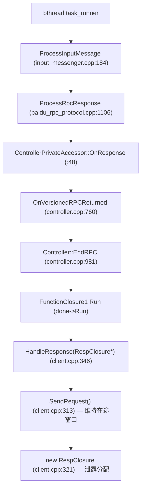

# ub_test Client RespClosure 泄露分析

> **现象**:ASan 报告
> ```
> Direct leak of 1680 byte(s) in 70 object(s) allocated from:
>     #1 PerformanceTest::SendRequest() ub_test_client
>     #2 PerformanceTest::HandleResponse(RespClosure*) ub_test_client
>     #3 brpc::internal::FunctionClosure1<...>::Run()
>     #4 brpc::Controller::EndRPC controller.cpp:981
>     #5 OnVersionedRPCReturned controller.cpp:760
>     #6 OnResponse controller_private_accessor.h:48
>     #7 ProcessRpcResponse baidu_rpc_protocol.cpp:1106
>     #8 ProcessInputMessage input_messenger.cpp:184
>     #9 bthread::TaskGroup::task_runner
> ```
> 本文分析该泄露并写入文档。

## 1. 泄露类别与归属

**这是 brpc 应用层(`ub_test/client.cpp`)的泄露,不是 ubsocket/umq 核心代码的泄露。** 与 `UBSOCKET-UMQ-RX-LEAK-ANALYSIS.ch.md`(RX 运行时增长)、`UBSOCKET-UMQ-TX-EVENT-LEAK-ANALYSIS.ch.md`(TX Event 启动期)两类**机理完全独立**——本泄露发生在 RPC 回调闭包管理,与 UB 传输无关,即使关掉 `use_ub`/`ubsocket_enable` 也存在。归入本系列文档仅为汇总 UB benchmark 跑出的全部 ASan 泄露。

## 2. 泄露对象与规模

- **对象**:`PerformanceTest::RespClosure`(`client.cpp:339-343`):

  ```cpp
  struct RespClosure {
      brpc::Controller* cntl;        // 8 bytes
      test::PerfTestResponse* resp;  // 8 bytes
      PerformanceTest* test;         // 8 bytes
  };
  ```
  = 3 个指针 = **24 字节/个**(64 位)。

- **数量**:70 个(ASan 报告时已完成的 RPC 数)。
- **总量**:70 × 24 = **1680 字节**,与报告精确吻合(1680 / 70 = 24)。

## 3. 调用栈解读



bthread 收到响应 → brpc 解析协议 → `EndRPC` → 调用户 `done->Run()`(即 `HandleResponse`)→ 维持在途窗口调 `SendRequest` 发下一个请求。泄露分配点在 `SendRequest` 的 `new RespClosure`,但**根因在 `HandleResponse` 不释放 `closure` 本体**。

## 4. 分配点

`PerformanceTest::SendRequest`(`client.cpp:313-336`):

```cpp
void SendRequest() {
    ...
    RespClosure* closure = new RespClosure;                    // ← 泄露分配(client.cpp:321)
    closure->resp = new test::PerfTestResponse();
    closure->cntl = new brpc::Controller();
    ...
    closure->test = this;
    google::protobuf::Closure* done = brpc::NewCallback(&HandleResponse, closure);  // 传指针
    test::PerfTestService_Stub stub(_channel);
    stub.Test(closure->cntl, &request, closure->resp, done);
}
```

`closure` 以**裸指针**传给 `brpc::NewCallback`,brpc 的 `FunctionClosure1<RespClosure*>` 持有该指针。`done->Run()` 触发 `HandleResponse(closure)`;`FunctionClosure1` 本身由 brpc 在 `Run()` 后自动 `delete`(frame #3 不泄露)。但 `closure`(RespClosure 实体)的所有权移交给了 `HandleResponse`,由其负责释放。

## 5. 释放缺失(根因)

`HandleResponse`(`client.cpp:346-392`)用 `unique_ptr` 管理了两个成员,却**漏了 `closure` 本体**:

```cpp
static void HandleResponse(RespClosure* closure) {
    std::unique_ptr<brpc::Controller> cntl_guard(closure->cntl);          // 管理 cntl
    std::unique_ptr<test::PerfTestResponse> response_guard(closure->resp);// 管理 resp
    ...
    cntl_guard.reset(NULL);          // ✓ 释放 cntl
    response_guard.reset(NULL);      // ✓ 释放 resp
    // ← 缺:没有任何 unique_ptr/delete 管理 closure 本体

    if (closure->test->_iterations == 0 && FLAGS_test_iterations > 0) {
        closure->test->_stop = true;
        return;                      // ✗ 退出1:closure 泄露
    }
    --closure->test->_iterations;
    ...
    if (now - closure->test->_start_time > FLAGS_test_seconds * 1000000u) {
        closure->test->_stop = true;
        return;                      // ✗ 退出2:closure 泄露
    }
    closure->test->SendRequest();    // ✗ 退出3:旧 closure 泄露,SendRequest 又 new 一个新的
}
```

**三条退出路径全部不释放 `closure`**:
1. 迭代次数用尽(`:372-375`)→ return,泄露
2. 测试时长到(`:387-390`)→ return,泄露
3. 正常重发(`:391` `SendRequest()`)→ 旧 closure 泄露,SendRequest 新建一个

即**每个完成的 RPC 都恰好泄露一个 `RespClosure`**(24 字节)。70 个完成 = 70 个泄露 = 1680 字节。

## 6. 触发条件

无条件——只要 RPC 完成(成功或失败),`HandleResponse` 被调,就泄露一个 `RespClosure`。与 UB 配置、QPS、连接数无关。ASan 报告里 70 个对象 = 报告采样时刻已完成的 RPC 计数(与 `g_total_cnt` 对应)。长时间压测会持续累积(每个 RPC 24 字节,10 万 RPC ≈ 2.4MB,虽不如 RX 泄露严重,但属于明确的代码缺陷)。

## 7. 修复方案

根因:`RespClosure` 本体无 RAII 管理且裸指针传递。三种修法,任选其一:

### 方案 1【推荐】`HandleResponse` 顶部用 unique_ptr 管 `closure` 本体

提前捕获 `test`(非拥有指针,安全),其余成员继续用既有 guard:

```cpp
static void HandleResponse(RespClosure* closure) {
    PerformanceTest* test = closure->test;                          // 捕获,后续 SendRequest 用
    std::unique_ptr<brpc::Controller> cntl_guard(closure->cntl);
    std::unique_ptr<test::PerfTestResponse> response_guard(closure->resp);
    ...
    cntl_guard.reset(NULL);
    response_guard.reset(NULL);

    bool stop = false;
    if (test->_iterations == 0 && FLAGS_test_iterations > 0) {
        test->_stop = true; stop = true;
    } else {
        --test->_iterations;
        uint64_t now = butil::gettimeofday_us();
        ... // CPU/内存统计
        if (now - test->_start_time > FLAGS_test_seconds * 1000000u) {
            test->_stop = true; stop = true;
        }
    }
    delete closure;          // ← 新增:释放 RespClosure 本体
    if (!stop) test->SendRequest();   // 用捕获的 test
}
```

要点:`delete closure` 必须在不再访问 `closure->*` 之后、`SendRequest` 之前;`test` 是 `PerformanceTest*`(由外层 `tests[]` 数组管理生命周期,`Test` 函数末尾 `delete t`,非本闭包所有),捕获为裸指针安全。

### 方案 2 让 `RespClosure` 自析构

`RespClosure` 改为持有 `unique_ptr<Controller>`/`unique_ptr<PerfTestResponse>`,自身析构即释放成员,再在 `HandleResponse` `unique_ptr<RespClosure>` 管本体。改动较大,但更符合现代 C++ 风格。

### 方案 3 显式 delete 三处

在每个 return 前和 `SendRequest()` 前补 `delete closure`。最小改动但易遗漏,不推荐(后续新增 return 路径会再次漏)。

推荐方案 1:改动小、RAII 兜底、不易复发。

## 8. 验证

修复后 ASan 重跑应无 1680 字节的 RespClosure 泄露报告。可用 `FLAGS_test_iterations` 设小值跑短测验证,对象计数应归零。

## 9. 关键代码位置索引

| 位置 | 作用 | 泄露相关性 |
|------|------|-----------|
| `client.cpp:321` | `new RespClosure` | **分配点** |
| `client.cpp:333` | `NewCallback(&HandleResponse, closure)` 传指针 | 所有权移交 HandleResponse |
| `client.cpp:339-343` | `RespClosure` 结构(3 指针=24B) | 泄露对象 |
| `client.cpp:347-348` | `unique_ptr` 管 cntl/resp | 成员释放 ✓ |
| `client.cpp:369-370` | `cntl_guard/response_guard.reset` | 成员释放 ✓ |
| `client.cpp:372-375` | 迭代退出 return | **closure 本体泄露** |
| `client.cpp:387-390` | 超时退出 return | **closure 本体泄露** |
| `client.cpp:391` | `SendRequest()` 重发 | **旧 closure 泄露** |
| brpc `controller.cpp:981` `EndRPC`→`done->Run` | 触发 HandleResponse | brpc 侧已正确释放 `done` 本身 |

## 10. 与其他泄露的关系

| 维度 | 本泄露(RespClosure) | RX 泄露 | TX Event 泄露 |
|------|---------------------|---------|---------------|
| 归属 | brpc 应用层(`ub_test/client.cpp`) | ubsocket umq 适配层 | ubsocket umq 适配层 |
| 与 UB 相关 | 否(关 UB 也存在) | 是 | 是 |
| 类别 | 回调闭包本体未释放 | 运行期 buffer 不回流 | 启动期分配退出未释放 |
| 对象 | `RespClosure` × RPC 数 | `umq_buf_t` 持续增长 | `TxEpollEvent` × 800(恒定) |
| 规模 | 24B/RPC(线性增长) | 涨到 5GB | 19KB |
| 修复点 | `client.cpp` HandleResponse | `umq_socket.cpp`/`umq_buffer_receive_queue.cpp` | `ubsocket.cpp`/`umq_transport_pool.cpp` |
| 优先级 | 中(代码质量) | 高(影响运行) | 低(不影响功能) |

三类泄露**机理独立、修复点不重叠**,需分别处理。本泄露属应用层,应由 `ub_test` 示例代码修复(或上报 brpc 仓库)。

## 参考

- `UBSOCKET-UMQ-RX-LEAK-ANALYSIS.ch.md` — RX 运行时增长泄露(ubsocket 核心)
- `UBSOCKET-UMQ-TX-EVENT-LEAK-ANALYSIS.ch.md` — TX Event 启动期泄露(ubsocket 核心)
- `UBSOCKET-BRPC-UB-TEST-FLOW.ch.md` — ub_test 端到端收发流程(SendRequest/HandleResponse 在途窗口模型)
- 源码:`brpc/example/ub_test/client.cpp:313-392`
