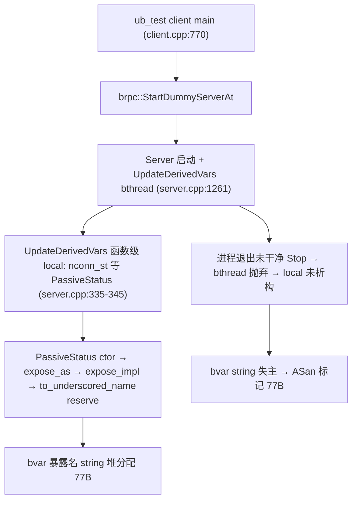

# brpc Dummy Server bvar PassiveStatus 字符串泄露分析

> **现象**:ASan 报告
> ```
> Direct leak of 77 byte(s) in 1 object(s) allocated from:
>     #1 std::__cxx11::basic_string::reserve
>     #2 bvar::to_underscored_name variable.cpp:943
>     #3 bvar::Variable::expose_impl variable.cpp:155
>     #4 bvar::PassiveStatus<int>::expose_impl passive_status.h:173
>     #5 bvar::Variable::expose_as variable.h:162
>     #6 bvar::PassiveStatus<int>::PassiveStatus passive_status.h:95
>     #7 brpc::Server::UpdateDerivedVars server.cpp:336
>     #8 bthread::TaskGroup::task_runner
> ```
>
> 本文确认其与 `UBSOCKET-UBTEST-DUMMY-SERVER-LEAK-ANALYSIS.ch.md`(vector 80B/1)是**同一个 `UpdateDerivedVars` bthread、同一次抛弃**的伴生泄露,仅泄露对象不同(bvar 暴露名 string vs vector 缓冲)。

## 1. 与 dummy server vector 泄露同根

| 维度 | dummy server vector 泄露 | 本泄露(bvar string) |
|------|--------------------------|---------------------|
| bthread | `Server::UpdateDerivedVars`(`server.cpp:315`) | **同** |
| frame #7 | `server.cpp:395`(`ListConnections(&conns)`) | `server.cpp:336`(`PassiveStatus` ctor) |
| 泄露对象 | `vector<SocketId>` 堆缓冲(80B) | `std::string` 堆缓冲(77B) |
| 分配点 | `Acceptor::ListConnections` reserve(`acceptor.cpp:222`) | `bvar::to_underscored_name` reserve(`variable.cpp:943`) |
| 根因 | bthread 抛弃致 local 未析构 | **同** |
| 修复 | 干净 `Server::Stop` 让 bthread ESTOP 退出 | **同** |

两者都是 `UpdateDerivedVars` bthread 的**函数级 local** 在进程退出时未被析构:`conns`/`internal_conns` vector 缓冲(80B)+ `PassiveStatus` bvar 对象暴露名 string(77B)+ 可能的其他 local,一次性全部失主泄露。

## 2. 泄露对象

- **对象**:`std::__cxx11::basic_string` 的堆缓冲(超出 SSO 32B 阈值,堆分配)。
- **分配点**:`bvar::to_underscored_name`(`variable.cpp:943`)`reserve`,经 `bvar::Variable::expose_impl` → `expose_as` → `PassiveStatus` 构造时调用。
- **大小**:77 字节(capacity,`reserve` 预留)。
- **归属 string**:`PassiveStatus` 暴露名,形如 `<prefix>_connection_count` 经 `to_underscored_name` 转换后的结果(超 SSO → 堆分配)。

## 3. 触发链



`UpdateDerivedVars`(`server.cpp:315`)在 `while(1)` 循环**外**声明多个 `bvar::PassiveStatus` local(`server.cpp:335-345`):

```cpp
bvar::PassiveStatus<int32_t> nconn_st(
    prefix, "connection_count", GetConnectionCount, server);   // server.cpp:335-336 — frame #7
bvar::PassiveStatus<int32_t> nservice_st(
    prefix, "service_count", GetServiceCount, server);
bvar::PassiveStatus<int32_t> nbuiltinservice_st(...);
bvar::PassiveStatus<bvar::Vector<unsigned, 2>> nsessiondata_st(...);
```

每个 `PassiveStatus` 构造即 `expose` 到全局 bvar registry,`expose_impl` 调 `to_underscored_name` 构造暴露名 string(超 SSO → 堆分配 77B)。这些 local 在 bthread 正常退出(ESTOP `return NULL`)时析构 → bvar `Unexpose` → string 释放。

## 4. 为何泄露(同 dummy server vector 泄露)

与 `UBSOCKET-UBTEST-DUMMY-SERVER-LEAK-ANALYSIS.ch.md` §5 完全相同:

- 正常路径:`Server::Stop()` → `bthread_usleep` 返回 ESTOP(`server.cpp:386-388` `return NULL`)→ 函数级 local(`nconn_st` 等 PassiveStatus + `conns`/`internal_conns` vector)离开作用域析构 → bvar `Unexpose` 释放 string + vector 释放缓冲。**无泄露**。
- 泄露路径:client 退出未对 dummy server 干净 `Stop()`,`UpdateDerivedVars` bthread 被抛弃 → 函数级 local 未析构 → bvar 暴露名 string(77B)+ vector 缓冲(80B)等全部失主 → ASan 标记。

## 5. 为何 77B / 1 个

- `to_underscored_name` 把 `<prefix>` + 暴露名拼成下划线形式,长度超 SSO 32B → 堆分配,capacity 77B。
- ASan 报 1 个 = `nconn_st` 的暴露名 string(frame #7 `server.cpp:336` 命中)。其余 `nservice_st`/`nbuiltinservice_st`/`nsessiondata_st` 的暴露名 string 应另有独立 ASan 报告(未粘贴),或其中部分 string 因长度恰好不超 SSO 不触发堆分配。
- 与 vector 80B/1 报告是**同一 bthread 抛弃**的两个独立泄露对象,应一并观察。

## 6. 触发条件

与 dummy server vector 泄露完全一致:进程启动 brpc Server(含 dummy server)→ `UpdateDerivedVars` bthread 运行 → 进程退出未干净 `Stop()` → bthread 抛弃。与 UB 配置无关。

## 7. 修复方案

**与 `UBSOCKET-UBTEST-DUMMY-SERVER-LEAK-ANALYSIS.ch.md` §8 完全共用**,修复一次消除两条(80B vector + 77B bvar string)报告:

### 方案 1【ub_test 侧】退出前显式 Stop dummy server

`ub_test/client.cpp:770` `StartDummyServerAt` 返回的 Server* 保存,`main` 返回前 `server->Stop(0)` + `server->Join()` → bthread ESTOP 退出 → 函数级 local(`PassiveStatus` + vector)析构 → bvar string + vector 缓冲释放。

### 方案 2【brpc 侧】Server 析构/Stop 保证 bthread join

`~Server`/`Stop` 中 `bthread_join(_derived_vars_bthread)`,确保 bthread 退出且 local 析构后再返回。根治。

### 方案 3【防御】bvar 暴露名用静态生命周期

bvar `PassiveStatus` 通常设计为静态/全局对象(进程级),非函数 local。`UpdateDerivedVars` 把 `nconn_st` 等改为 `static` 或 Server 成员,生命周期与进程/Server 一致,避免依赖 bthread 析构时机。但需注意 bvar registry 的重复 expose 检查。

## 8. ubs-comm 侧动作

**无。** 与 ubsocket/umq 适配层无任何代码关联。属 brpc 生命周期 + ub_test dummy server 启停问题。

## 9. 关键代码位置索引

| 位置 | 作用 | 泄露相关性 |
|------|------|-----------|
| `server.cpp:335-336` | `PassiveStatus nconn_st` ctor | **frame #7,泄露触发** |
| `server.cpp:338-345` | `nservice_st`/`nbuiltinservice_st`/`nsessiondata_st` | 同类(应有报告) |
| `passive_status.h:95` | `PassiveStatus` ctor → `expose_as` | 调用链 |
| `variable.h:162` | `expose_as` → `expose_impl` | 调用链 |
| `variable.cpp:155` | `expose_impl` → `to_underscored_name` | 调用链 |
| `variable.cpp:943` | `to_underscored_name` `reserve` | **string 堆分配点** |
| `server.cpp:315-345` | `UpdateDerivedVars` 函数级 local | bthread 抛弃致不析构 |
| `server.cpp:1261` | `bthread_start_background(UpdateDerivedVars)` | bthread 启动 |

## 10. 与其他泄露的关系

| 维度 | 本泄露(bvar string) | dummy server vector | TX Event | RespClosure/done | RX | 析构链家族 | RpcMeta |
|------|---------------------|----------------------|----------|------------------|----|-----------|---------|
| 归属 | brpc Server/bvar + ub_test dummy | 同 | ubsocket umq | ub_test | ubsocket umq | ubsocket 核心 | brpc/protobuf |
| 类别 | bthread 抛弃致 bvar local 未析构 | 同(同 bthread) | 退出未释放 | 闭包/drain | buffer 不回流 | 析构不 delete | 解析逃逸 |
| 与 dummy vector 关系 | **同根同 bthread** | 自身 | 独立 | 独立 | 独立 | 独立 | 独立 |
| ubs-comm 修复 | ❌ | ❌ | ✓ | ❌ | ✓ | ✓ | ❌ |

本泄露与 dummy server vector 泄露是**同一 bthread 抛弃的两个泄露对象**,应作为一组观察/定位,共用修复方案。

## 参考

- `UBSOCKET-UBTEST-DUMMY-SERVER-LEAK-ANALYSIS.ch.md` — dummy server vector 泄露(同根,方案共用)
- `UBSOCKET-UMQ-TX-EVENT-LEAK-ANALYSIS.ch.md` — 同样由 `StartDummyServerAt` 触发(client.cpp:770)
- 其他 ubs-comm/ub_test/brpc 泄露文档
- brpc 源码:`src/brpc/server.cpp:315-345,1261`、`src/bvar/variable.cpp:155,943`、`src/bvar/passive_status.h:95,173`
- ub_test 源码:`brpc/example/ub_test/client.cpp:770`
