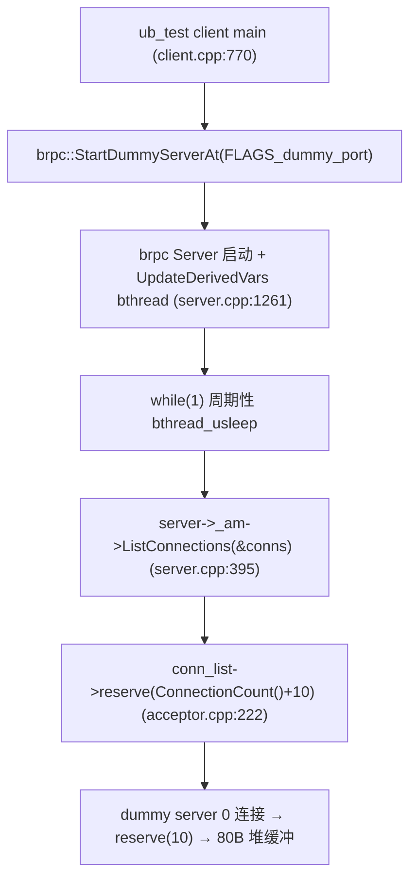

# brpc Dummy Server UpdateDerivedVars vector 泄露分析

> **现象**:ASan 报告
> ```
> Direct leak of 80 byte(s) in 1 object(s) allocated from:
>     #1 std::__new_allocator<unsigned long>::allocate
>     #2 std::_Vector_base::_M_allocate
>     #3 std::vector<unsigned long>::reserve vector.tcc:79
>     #4 brpc::Acceptor::ListConnections acceptor.cpp:222
>     #5 brpc::Acceptor::ListConnections acceptor.cpp:253
>     #6 brpc::Server::UpdateDerivedVars server.cpp:395
>     #7 bthread::TaskGroup::task_runner
> ```
>
> 本文定位其归属与触发链。

## 1. 泄露类别与归属

**这是 brpc 内部 Server/Acceptor 的泄露,不在 ubs-comm,也不在 ub_test 应用层代码。** 由 ub_test client 启动 `StartDummyServerAt`(监控用 dummy server)间接触发——dummy server 的 `UpdateDerivedVars` bthread 周期性 `reserve` 一个 `vector<SocketId>`,进程退出时该 bthread 未被干净停止,持久 local 的堆缓冲未析构 → 泄露。

## 2. 泄露对象

- **对象**:`std::vector<SocketId>`(即 `vector<unsigned long>`)的内部堆缓冲。
- **分配点**:`Acceptor::ListConnections`(`acceptor.cpp:222`)`conn_list->reserve(ConnectionCount() + 10)`。
- **大小**:80 字节 = 10 × 8B(`sizeof(SocketId)==sizeof(unsigned long)==8` on 64-bit)。
- **数量**:1 个。

## 3. 触发链(从 ub_test 入 brpc)



`StartDummyServerAt`(`server.cpp:1995` 附近)创建一个监听 dummy port 的 Server,主要用于 brpc 自身监控/builtin service。该 Server 启动 `UpdateDerivedVars` bthread(`server.cpp:1261` `bthread_start_background(..., UpdateDerivedVars, this)`)。

## 4. 代码细节

`Server::UpdateDerivedVars`(`server.cpp:315`):

```cpp
void* Server::UpdateDerivedVars(void* arg) {
    ...
    std::vector<SocketId> conns;            // server.cpp:320 — 循环外持久 local
    std::vector<SocketId> internal_conns;  // server.cpp:321 — 同
    int64_t last_time = butil::gettimeofday_us();
    int consecutive_nosleep = 0;
    while (1) {
        const int64_t sleep_us = ...;
        ...
        if (bthread_usleep(sleep_us) < 0) {   // ESTOP 时返回 <0
            PLOG_IF(ERROR, errno != ESTOP) << ...;
            return NULL;                       // ← 正常退出:bthread 退出,conns 析构释放缓冲
        }
        ...
        if (server->_am) {
            server->_am->ListConnections(&conns);     // server.cpp:395
        }
        ...
    }
}
```

`Acceptor::ListConnections`(`acceptor.cpp:213-250`):

```cpp
void Acceptor::ListConnections(std::vector<SocketId>* conn_list, size_t max_copied) {
    ...
    conn_list->clear();                                      // 保留 capacity(不释放缓冲)
    conn_list->reserve(ConnectionCount() + 10);              // acceptor.cpp:222 — 仅当 n>capacity 才分配
    ...
    conn_list->push_back(it->first);
}
```

- `conns` 是 `UpdateDerivedVars` 的**函数级持久 local**(循环外声明),每轮 `clear()`(保 capacity)+ `reserve()`(首次分配 80B,后续 no-op)+ `push_back`。
- dummy server 无真实连接,`ConnectionCount()==0` → `reserve(10)` → 首轮分配 80B 缓冲。
- 后续每轮 `reserve(10)` 因 `capacity()>=10` 不再分配,缓冲复用。

## 5. 为何泄露

正常路径:`Server::Stop()` 触发 `bthread_usleep` 返回 ESTOP(`:386-388` `return NULL`)→ `conns` 离开作用域析构 → 缓冲释放。

**泄露路径**:client 进程退出时未对 dummy server 调 `Stop()`(或 `Stop` 未及完成),`UpdateDerivedVars` bthread 被**抛弃**——其栈上的 `conns` 未走析构 → 堆缓冲(80B)失去拥有者 → 不可达 → ASan 标记。

可能伴随 bthread 库回收该 bthread 栈(使栈上的 `conns` 引用消失),堆缓冲彻底无主。

## 6. 为何 80B / 1 个

- `conns`:`reserve(0+10)=10` → 80B。dummy server 主 acceptor 有 0 连接,首次 reserve 分配 80B。
- `internal_conns`(`server.cpp:398`):`if (server->_internal_am)` —— dummy server 可能无 `_internal_am`(或同样 0 连接 reserve 80B)。ASan 报 1 个 → 实际仅 1 个 vector 的缓冲泄露(要么 `_internal_am` 为空未 reserve,要么 ASan 分组只命中其一)。

## 7. 触发条件

- 进程启动了 brpc Server(含 dummy server)→ `UpdateDerivedVars` bthread 运行
- 进程退出时未干净 `Server::Stop()`(ESTOP)bthread → local vector 未析构
- 与 UB 配置无关,纯 TCP 模式也复现(任何 brpc Server + 不干净退出)
- client(`StartDummyServerAt`)与真正 server 都会触发,本次报在 `ub_test_client`(dummy server)

## 8. 修复方案

本泄露根因是 **dummy server 退出流程不干净**,属 brpc/ub_test 启停生命周期。两种修法:

### 方案 1【ub_test 侧】退出前显式 Stop dummy server

`ub_test/client.cpp:770` 的 `brpc::StartDummyServerAt(FLAGS_dummy_port)` 返回的 Server* 需保存,`main` 返回前 `server->Stop(0)` + `server->Join()`(或 `server->RunUntilAskedToQuit` 配合信号),让 `UpdateDerivedVars` bthread 经 ESTOP 干净退出 → `conns` 析构 → 缓冲释放。

`StartDummyServerAt` 当前实现若不暴露 Server* 给调用方,需 brpc 侧调整接口或 ub_test 自建 dummy server 并管理生命周期。

### 方案 2【brpc 侧】Server 析构保证 bthread join

`~Server` 或 `Stop` 中 `bthread_join(_derived_vars_bthread)`,确保 bthread 退出且 local 析构后再返回。根治方案 1 无法覆盖的场景(brpc 内部 Server 自启停)。

### 方案 3【防御】local 改为成员 + Stop 时 clear

`conns`/`internal_conns` 改为 Server 成员(`std::vector<SocketId> _derived_conns`),`Stop` 时 `clear(); shrink_to_fit()` 释放缓冲。避免依赖 bthread 析构时机。

## 9. ubs-comm 侧动作

**无。** 本泄露与 ubsocket/umq 适配层无任何代码关联。属 brpc 生命周期 + ub_test dummy server 启停问题。

## 10. 与其他泄露的关系

| 维度 | 本泄露(dummy server vector) | 其他 8 类 |
|------|------------------------------|----------|
| 归属 | brpc 内部 Server/Acceptor + ub_test dummy 启停 | ubsocket/umq 或 ub_test 应用或 brpc/protobuf |
| 类别 | bthread 抛弃致 local vector 未析构 | 各自独立 |
| 规模 | 80B(1) | 5GB~96B 不等 |
| 优先级 | 低(80B) | RX 高,其余低/中 |
| ubs-comm 修复 | ❌ | RX/TX Event/Acceptor/DataOps 可修 |

本泄露是 10 类中**唯一由 dummy server bthread 抛弃引发**的,与 RPC 数据通路无关。

## 参考

- `UBSOCKET-UMQ-TX-EVENT-LEAK-ANALYSIS.ch.md` — 同样由 `StartDummyServerAt` 触发(client.cpp:770),但泄露点不同(TX Event 启动期分配)
- 其他 ubs-comm/ub_test/brpc 泄露文档
- brpc 源码:`src/brpc/server.cpp:315-409,1261`、`src/brpc/acceptor.cpp:213-254`
- ub_test 源码:`brpc/example/ub_test/client.cpp:770`
