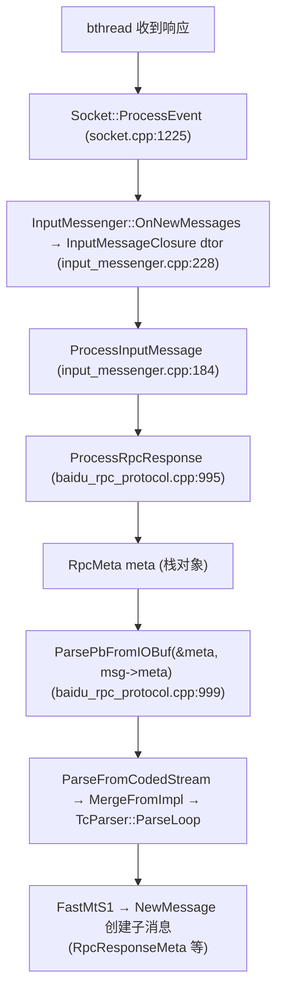

# brpc RpcMeta 解析子消息泄露分析

> **现象**:ASan 报告
> ```
> Direct leak of 280 byte(s) in 7 object(s) allocated from:
>     #1 google::protobuf::internal::MessageCreator::New message_lite.h:1439
>     #2 ClassData::New message_lite.h:445
>     #3 TcParser::NewMessage generated_message_tctable_lite.cc:638
>     #5 TcParser::FastMtS1 generated_message_tctable_lite.cc:696
>     #8 MessageLite::MergeFromImpl message_lite.cc:339
>     #9 ParseFromCodedStream message_lite.cc:362
>     #10 ParsePbFromIOBuf protocol.cpp:216
>     #11 ParsePbFromIOBuf protocol.cpp:238
>     #12 ProcessRpcResponse baidu_rpc_protocol.cpp:999
>     #13 ProcessInputMessage input_messenger.cpp:184
>     #15 Socket::ProcessEvent socket.cpp:1225
> ```
> 本文定位泄露归属与可能的逃逸路径。

## 1. 泄露类别与归属

**这是 brpc/protobuf 协议解析层的泄露,不在 ubs-comm,也不在 ub_test 应用层。** 与本系列前 4 篇(`RX`/`TX Event`/`RespClosure`/`Acceptor`)均不同——那些要么在 ubsocket 核心、要么在 ub_test 应用代码;本泄露发生在 brpc 解析 `RpcMeta` 时由 protobuf `TcParser` 创建的子消息上,属 brpc/protobuf 第三方层。

## 2. 泄露对象

- **对象**:`RpcMeta` 解析过程中由 `TcParser::NewMessage` 创建的**子消息**(protobuf message)。
- **调用点**:`ProcessRpcResponse`(`baidu_rpc_protocol.cpp:999`)的 `ParsePbFromIOBuf(&meta, msg->meta)`。
- **规模**:7 个对象 × 40 字节 = **280 字节**(280/7=40)。
- **40B/个的判据**:`RpcMeta` 的子消息 `RpcResponseMeta`(int32 error_code + string error_text)、`StreamSettings`、`UserField` 等小型 message,对象头 + 字段开销约 40B,吻合。
- **`FastMtS1` 含义**:Fast Mt S1 = "Message-type Singular 1-byte tag",即解析 `RpcMeta` 中字段号 1~15 的 singular 子消息字段(如 `request`/`response`/`stream_settings`)。

`test.proto` 的 `PerfTestResponse` 只有 `string`/`bytes` 标量字段,**无 message 字段**,所以 `FastMtS1` 不会是解析 `PerfTestResponse`,只能是 brpc 内部的 `RpcMeta`。

## 3. 调用路径



`RpcMeta meta` 在 `ProcessRpcResponse` 是**栈对象**(`baidu_rpc_protocol.cpp:998`)。`ParsePbFromIOBuf` 把 `msg->meta`(响应里的 meta 字节流)解析进 `meta`,期间 `TcParser` 为每个 singular 子消息字段 `new` 一个子 message 并挂到 `meta` 的字段上,所有权归 `meta`。

## 4. 疑点:栈对象的子消息为何泄露

`ProcessRpcResponse` 在所有退出路径(`:1001` parse 失败、`:1020` cid 锁失败、`:1106` 正常结束)都让 `meta` 离开作用域 → `~RpcMeta` 析构 → protobuf 自动 `delete` 其拥有的子消息。**理论上不应泄露**。7 个对象泄露说明**子消息脱离了 `meta` 的所有权**,可能机制:

### 机制 A【最可疑】Controller 拷贝了 meta 子消息但清理不完整

`ProcessRpcResponse` 中有两处把 `meta` 的子消息**拷贝**到 Controller 持有的堆对象:

```cpp
// baidu_rpc_protocol.cpp:1024-1027
if (remote_stream_id != INVALID_STREAM_ID) {
    accessor.set_remote_stream_settings(
            new StreamSettings(meta.stream_settings()));   // ← new StreamSettings 堆对象,Controller 持有
}

// :1029-1033
if (!meta.user_fields().empty()) {
    for (const auto& it : meta.user_fields()) {
        (*cntl->response_user_fields())[it.first] = it.second;  // 拷贝 string,无 message
    }
}
```

`new StreamSettings(...)` 是 `RpcMeta` 子消息类型 `StreamSettings` 的堆拷贝,所有权经 `set_remote_stream_settings` 转交 Controller。若 **Controller 析构链未 `delete remote_stream_settings`**(brpc Controller 内部所有权缺陷),则该 StreamSettings 泄露——每个带 `stream_settings` 的响应泄露 1 个。

**但 ub_test 是简单 RPC,不带 streaming**(`meta.has_stream_settings()` 应为 false)→ 此路径不该触发。故机制 A 在 ub_test 场景下不是主因,除非 server 返回了带 stream_settings 的响应。

### 机制 B RpcResponseMeta 在错误路径逃逸

`response_meta = meta.response()`(`:1043`)取的是 `meta` 子消息的 **const 引用**。后续 `response_meta.error_code()`/`error_text()` 都是值语义读取,不转移所有权。若某错误路径(`SetFailed` 后)对 `response_meta` 做了移动语义操作则可能逃逸——当前代码未见,概率低。

### 机制 C protobuf TcParser / Arena 内部缺陷

`MessageCreator::New(Arena*)` 的 `Arena*` 参数:对栈 `RpcMeta meta`(无 Arena),`Arena==nullptr`,子消息堆分配归 `meta` 所有。protobuf 5.x 的 `TcParser` 在特定字段组合下存在已知 cache/prototype 语义,若与 brpc 的 `MergeFromImpl` 交互异常,可能产生脱离父消息的孤儿对象。属 protobuf 库内部,需 protobuf 侧定位。

### 机制 D 与 RespClosure 泄露的衍生交互

`UBSOCKET-UBTEST-CLIENT-LEAK-ANALYSIS.ch.md` 中 `RespClosure`(70 个)泄露的是**闭包结构体本身**(24B),其 `closure->cntl`/`closure->resp` 已被 `HandleResponse` 的 `unique_ptr` `reset` 删除。故 Controller 已析构 → Controller 持有的子消息应已释放。**理论上无衍生泄露**。但若某些 RPC 的 `done->Run()` 未被调用(brpc 内部异常),则 Controller 不删除 → 其持有的 `remote_stream_settings` 等泄露。需结合 RespClosure 修复后复测判定。

## 5. 当前可下结论

| 维度 | 结论 |
|------|------|
| 归属 | brpc/protobuf 协议解析层(第三方) |
| 是否 ubs-comm | ❌ 否 |
| 是否 ub_test 应用层 | ❌ 否 |
| 对象 | `RpcMeta` 解析创建的子消息(RpcResponseMeta/StreamSettings 等) |
| 规模 | 280B(7×40B),极小 |
| 根因 | 子消息脱离栈 `RpcMeta meta` 所有权;具体逃逸点需 brpc/protobuf 侧深挖(机制 A/B/C/D 待排除) |
| 优先级 | 低(280B 不影响功能与容量) |

## 6. 验证与定位步骤

由于泄露在 brpc/protobuf 层、规模极小,建议**先修本系列其他可定位泄露再复测**,避免被衍生干扰:

1. **先修 RespClosure 泄露**(`UBSOCKET-UBTEST-CLIENT-LEAK-ANALYSIS.ch.md` 方案 1)。修复后重跑 ASan,若本 280B 泄露消失 → 机制 D(RespClosure 衍生)坐实。
2. 若仍存在,在 `baidu_rpc_protocol.cpp:1026` 加计数(打 `new StreamSettings` 次数 vs Controller 析构 `delete remote_stream_settings` 次数),判定是否机制 A。
3. 若机制 A/B 排除,则属 protobuf `TcParser` 内部(机制 C),换 protobuf 版本复测或上报 protobuf 社区。

## 7. 是否需要 ubs-comm 侧动作

**否。** 本泄露与 ubsocket/umq 适配层无任何代码关联(关掉 `ubsocket_enable` 用纯 TCP 也会出现,只要 brpc 跑 RPC 响应解析)。ubs-comm 侧无需改动。若最终定位为 brpc 缺陷,应上报 brpc 仓库。

## 8. 与其他泄露的关系

| 维度 | 本泄露(RpcMeta 子消息) | RX 泄露 | TX Event | RespClosure | Acceptor |
|------|------------------------|---------|---------|-------------|----------|
| 归属 | brpc/protobuf 第三方 | ubsocket umq | ubsocket umq | ub_test 应用 | ubsocket 核心 |
| 类别 | 协议解析子消息逃逸 | buffer 不回流 | 退出未释放 | 闭包未释放 | 析构不 delete |
| 规模 | 280B(7) | 5GB | 19KB | 1.7KB(70) | 288B(1) |
| 优先级 | 低 | 高 | 低 | 中 | 中 |
| ubs-comm 修复 | ❌ 否 | ✓ 是 | ✓ 是 | ❌ 否 | ✓ 是 |

本泄露是 5 类中**唯一不在 ubs-comm 范围内**的,ubs-comm 侧无可改代码。

## 参考

- `UBSOCKET-UBTEST-CLIENT-LEAK-ANALYSIS.ch.md` — RespClosure 泄露(可能与之有衍生交互)
- `UBSOCKET-UMQ-RX-LEAK-ANALYSIS.ch.md` / `UBSOCKET-UMQ-TX-EVENT-LEAK-ANALYSIS.ch.md` / `UBSOCKET-UMQ-ACCEPTOR-LEAK-ANALYSIS.ch.md` — ubs-comm 侧泄露
- brpc 源码:`src/brpc/policy/baidu_rpc_protocol.cpp:995-1107`、`src/brpc/protocol.cpp:205-238`
- protobuf:`message_lite.cc:339,362`、`generated_message_tctable_lite.cc:638,665,696`
