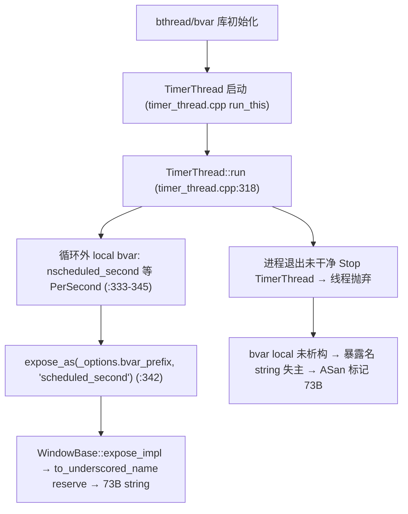

# brpc TimerThread bvar PerSecond 字符串泄露分析

> **现象**:ASan 报告
> ```
> Direct leak of 73 byte(s) in 1 object(s) allocated from:
>     #1 std::__cxx11::basic_string::reserve
>     #2 bvar::to_underscored_name variable.cpp:943
>     #3 bvar::Variable::expose_impl variable.cpp:155
>     #4 bvar::detail::WindowBase<PassiveStatus<unsigned long>, SeriesFrequency::1>::expose_impl window.h:147
>     #5 bvar::Variable::expose_as variable.h:162
>     #6 bthread::TimerThread::run timer_thread.cpp:342
>     #7 bthread::TimerThread::run_this timer_thread.cpp:125
> ```
>
> 本文确认其与 `UBSOCKET-UBTEST-DUMMY-SERVER-BVAR-LEAK-ANALYSIS.ch.md`(77B)是**同一家族**——bvar local 在长跑线程中,进程退出时线程被抛弃致 local 未析构、暴露名 string 泄露。仅线程与 bvar 对象不同。

## 1. 与 UpdateDerivedVars bvar 泄露同家族

| 维度 | UpdateDerivedVars bvar 泄露(77B) | 本泄露(TimerThread bvar 73B) |
|------|----------------------------------|----------------------------|
| 线程 | `Server::UpdateDerivedVars` bthread | **`bthread::TimerThread`**(pthread) |
| 泄露对象 | `PassiveStatus` 暴露名 string(77B) | `PerSecond<PassiveStatus<ulong>>` 暴露名 string(73B) |
| 分配点 | `to_underscored_name` reserve(`variable.cpp:943`) | **同** |
| bvar 类型 | `PassiveStatus<int>` | `WindowBase<PassiveStatus<ulong>, SERIES_FREQ::1>`(即 `PerSecond`) |
| frame #7 | `server.cpp:336`(`nconn_st` ctor) | `timer_thread.cpp:342`(`nscheduled_second.expose_as`) |
| 根因 | 线程被抛弃致 bvar local 未析构 | **同** |
| 修复 | 干净 Stop 让线程退出→local 析构 | **同** |

两者都是**长跑线程在循环外声明 bvar local,`expose_as` 在 bvar registry 注册暴露名 string(超 SSO 堆分配);进程退出时线程未干净停止/join,local 未走析构 → bvar 未 Unexpose → string 失主泄露**。

## 2. 泄露对象

- **对象**:`std::__cxx11::basic_string` 堆缓冲(超 SSO 32B → 堆分配),bvar 暴露名。
- **分配点**:`bvar::to_underscored_name`(`variable.cpp:943`)`reserve`,经 `WindowBase::expose_impl`(`window.h:147`)→ `Variable::expose_impl` → `expose_as`。
- **大小**:73 字节(capacity)。
- **归属 string**:`<bvar_prefix>_scheduled_second` 经 `to_underscored_name` 转换后的暴露名。

## 3. 触发链



## 4. 代码细节

`bthread::TimerThread::run`(`timer_thread.cpp:318`)在 `while(!_stop)` 循环**外**声明多个 bvar local(`timer_thread.cpp:333-345`):

```cpp
void TimerThread::run() {
    ...
    std::vector<Task*> tasks;
    tasks.reserve(4096);

    // vars — 循环外持久 local
    size_t nscheduled = 0;
    bvar::PassiveStatus<size_t> nscheduled_var(deref_value<size_t>, &nscheduled);
    bvar::PerSecond<bvar::PassiveStatus<size_t>> nscheduled_second(&nscheduled_var);   // :334
    size_t ntriggered = 0;
    bvar::PassiveStatus<size_t> ntriggered_var(deref_value<size_t>, &ntriggered);
    bvar::PerSecond<bvar::PassiveStatus<size_t>> ntriggered_second(&ntriggered_var);    // :337
    double busy_seconds = 0;
    bvar::PassiveStatus<double> busy_seconds_var(deref_value<double>, &busy_seconds);
    bvar::PerSecond<bvar::PassiveStatus<double>> busy_seconds_second(&busy_seconds_var);// :340
    if (!_options.bvar_prefix.empty()) {
        nscheduled_second.expose_as(_options.bvar_prefix, "scheduled_second");   // :342 ← frame #6
        ntriggered_second.expose_as(_options.bvar_prefix, "triggered_second");    // :343
        busy_seconds_second.expose_as(_options.bvar_prefix, "usage");            // :344
    }

    while (!_stop.load(butil::memory_order_relaxed)) {
        ...
    }
}
```

- `nscheduled_second`/`ntriggered_second`/`busy_seconds_second` 是 **`PerSecond<PassiveStatus<...>>`**(`WindowBase` 派生),函数级持久 local。
- `_options.bvar_prefix` 非空时,三者 `expose_as` 注册到 bvar registry,`to_underscored_name` 构造暴露名 string(`<prefix>_scheduled_second` 等,超 SSO → 堆分配 73B)。
- 正常退出:`_stop` 置 → `while` 结束 → 函数返回 → local 析构 → bvar `Unexpose` → string 释放。
- 泄露:进程退出未干净停止 TimerThread → run 函数未返回 → local 未析构 → string 失主。

## 5. 为何 73B / 1 个

- `to_underscored_name(_options.bvar_prefix, "scheduled_second")` 结果长度超 SSO 32B → 堆分配,capacity 73B。
- ASan 报 1 个 = `nscheduled_second` 的暴露名 string(frame #6 `:342` 命中)。`ntriggered_second`(`:343`)/`busy_seconds_second`(`:344`)的暴露名 string 应另有独立 ASan 报告(未粘贴),或其中部分因长度恰好不超 SSO 不触发堆分配。
- 与 UpdateDerivedVars bvar 泄露(77B)是**不同线程、不同 bvar 对象**的两个独立泄露,同根因。

## 6. 触发条件

- bthread/bvar 库初始化(任何 brpc 程序)→ TimerThread 启动
- `_options.bvar_prefix` 非空(配置了 timer bvar 前缀)→ `expose_as` 注册暴露名
- 进程退出未干净 `TimerThread::Stop()` + join → 线程抛弃 → local 未析构
- 与 UB 配置无关,纯 brpc/bthread 库行为
- 本次报在 `ub_test_client`(client 启动 brpc 全局→TimerThread 启动)

## 7. 修复方案

**与 `UBSOCKET-UBTEST-DUMMY-SERVER-BVAR-LEAK-ANALYSIS.ch.md` §7 同家族**,brpc/bthread 侧确保 TimerThread 干净停止:

### 方案 1【brpc/bthread 侧】退出前 TimerThread::Stop + join

bthread 全局退出(`bthread_stop_world`/atexit)中 `TimerThread::Stop()`(`_stop=true`)+ `pthread_join(_tid)`,确保 `run` 返回 → local 析构 → bvar Unexpose → string 释放。根治。

### 方案 2【brpc/bvar 侧】bvar local 改静态/进程级

`TimerThread::run` 的 `nscheduled_second` 等改为 `static` 或 bthread 全局对象,生命周期与进程一致,bvar registry 持有引用可达,不依赖线程析构时机。但需注意 bvar 重复 expose 检查与多 TimerThread 实例场景。

### 方案 3【防御】bvar registry atexit 清理

bvar `Variable` 全局 registry 注册 atexit 钩子,退出时遍历 Unexpose 释放所有暴露名 string,覆盖所有 bvar local 未析构场景(含 UpdateDerivedVars / TimerThread)。

## 8. ubs-comm 侧动作

**无。** 与 ubsocket/umq 适配层无任何代码关联。属 brpc/bthread/bvar 库生命周期问题。

## 9. 关键代码位置索引

| 位置 | 作用 | 泄露相关性 |
|------|------|-----------|
| `timer_thread.cpp:318` | `TimerThread::run` | 线程主函数 |
| `timer_thread.cpp:333-345` | bvar PerSecond local + expose_as | **frame #6/:342 泄露触发** |
| `timer_thread.cpp:125` | `run_this`→`run` | pthread 入口 |
| `window.h:147` | `WindowBase::expose_impl` | PerSecond 暴露链 |
| `variable.cpp:155` | `Variable::expose_impl` → `to_underscored_name` | 调用链 |
| `variable.cpp:943` | `to_underscored_name` `reserve` | **string 堆分配点** |
| `passive_status.h`/`window.h` | PerSecond/WindowBase 定义 | bvar 类型 |

## 10. 与其他泄露的关系

| 维度 | 本泄露(TimerThread bvar) | UpdateDerivedVars bvar | dummy vector | TX Event | RespClosure/done | RX | 析构链家族 | RpcMeta |
|------|--------------------------|----------------------|-------------|----------|------------------|----|-----------|---------|
| 归属 | brpc bthread/bvar | brpc Server + ub_test dummy | 同 | ubsocket umq | ub_test | ubsocket umq | ubsocket 核心 | brpc/protobuf |
| 类别 | bvar local 未析构 | 同 | bthread 抛弃致 vector 未析构 | 退出未释放 | 闉包/drain | buffer 不回流 | 析构不 delete | 解析逃逸 |
| 与 UpdateDerivedVars bvar 关系 | **同家族** | 自身 | 同 bthread 抛弃类 | 独立 | 独立 | 独立 | 独立 | 独立 |
| ubs-comm 修复 | ❌ | ❌ | ❌ | ✓ | ❌ | ✓ | ✓ | ❌ |

本泄露与 UpdateDerivedVars bvar 泄露(77B)是**同家族不同线程**,与 dummy server vector 泄露(80B)是**同类不同对象**(都是长跑线程 local 未析构)。三者均为 brpc 库生命周期问题,ubs-comm 无修复点。

## 参考

- `UBSOCKET-UBTEST-DUMMY-SERVER-BVAR-LEAK-ANALYSIS.ch.md` — UpdateDerivedVars bvar 泄露(同家族,77B)
- `UBSOCKET-UBTEST-DUMMY-SERVER-LEAK-ANALYSIS.ch.md` — dummy server vector 泄露(同类 bthread 抛弃,80B)
- 其他 ubs-comm/ub_test/brpc 泄露文档
- brpc 源码:`src/bthread/timer_thread.cpp:125,318-345`、`src/bvar/window.h:147`、`src/bvar/variable.cpp:155,943`
