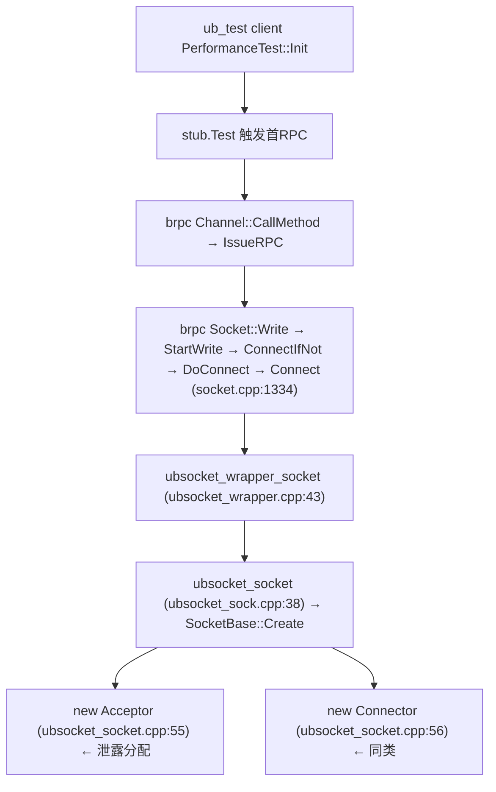

# UBSocket Acceptor/Connector 析构链泄露分析

> **现象**:ASan 报告
> ```
> Direct leak of 288 byte(s) in 1 object(s) allocated from:
>     #1 ock::ubs::SocketBase::Create(...) ubsocket_socket.cpp:55
>     #2 ubsocket_socket ubsocket_sock.cpp:38
>     #3 ubsocket_wrapper_socket ubsocket_wrapper.cpp:43
>     #4 brpc::Socket::Connect socket.cpp:1334
>     ...
>     #12 PerformanceTest::Init() ub_test/client.cpp
> ```
> 本文定位泄露对象与析构链缺陷。

## 1. 泄露对象(关键纠正)

**泄露对象是 `Acceptor`(288B),不是 `UmqSocket`。** ASan frame `#1` 指向 `ubsocket_socket.cpp:55`,该行是:

```cpp
sockBase->acceptor_ = new Acceptor(sock, acceptorOps);   // line 55 — 泄露分配
sockBase->connector_ = new Connector(sock, connectorOps); // line 56 — 同类问题
```

`Acceptor` 是 `SocketBase` 的裸指针成员(`ubsocket_socket.h:94` `Acceptor *acceptor_ = nullptr`)。288 字节 = `sizeof(Acceptor)`,其成员(`ubsocket_socket_acceptor.h:107-115`):`int raw_fd_` + `Ref<AcceptorOps> acceptor_ops_` + `AsyncAcceptInfo{std::queue + atomic + u_mutex_t*}` + `UbsocketWakeupEvent wakeup_event_`,合计对齐到 288B,与报告吻合。

## 2. 泄露类别

**析构链不完整导致的退出清理缺失**——与 `UBSOCKET-UMQ-TX-EVENT-LEAK-ANALYSIS.ch.md`(启动期未释放)同类,但根因不同:前者是 `TxEpollEvent` 无释放路径,本泄露是 `Acceptor`/`Connector` 有析构函数但**从不被 `delete` 调用**。

## 3. 调用栈解读



client 首次 RPC 触发 `brpc::Socket::Connect`,`ubsocket_wrapper_socket` → `ubsocket_socket` → `SocketBase::Create` 创建 `UmqSocket` 并 `new Acceptor`/`new Connector` 挂到 `SocketBase::acceptor_`/`connector_`,存入 `ArraySet<Socket>`(`ubsocket_sock.cpp:46`)。

## 4. 引用计数模型回顾(排除 UmqSocket 本体泄露)

`Ref<T>`(`ubsocket_ref.h`):`IncreaseRef`/`DecreaseRef`,`ref_count_==1` 时 `delete this`。`ArraySet::OverrideItem`(`ubsocket_set.h:68-82`):新值 `IncreaseRef`,旧值经返回的 `Ref<T>` 持有,调用方释放即 `DecreaseRef`。

`ubsocket_close`(`ubsocket_sock.cpp:64`)→ `OverrideItem(fd, nullptr)` → 释放 ArraySet 持有的那根 ref。若 `ref_count` 归零 → `delete this` → `~UmqSocket`→`UnInitialize`→`~SocketBase`→`~Socket`。

**关键排除**:`Acceptor`/`Connector` 构造只取 `sock->raw_socket_`(`ubsocket_socket_acceptor.h:60`、`ubsocket_socket_connector.h:49-53`),**不持有 `SocketPtr`**——无自引用环。`UmqTxOps`/`UmqRxOps`/`DataTx`/`DataRx` 同样只存 `fd_`/`umq_handle_`,不持 SocketPtr。因此 UmqSocket 本体 ref 计数干净,泄露不在引用环。

## 5. 析构链缺陷(根因)

`SocketBase` 持裸指针 `acceptor_`/`connector_`(`ubsocket_socket.h:94-95`),但**整条析构链都不 `delete` 它们**:

| 析构/清理点 | 是否 delete acceptor_/connector_ | 说明 |
|------------|-------------------------------|------|
| `~SocketBase`(`ubsocket_socket.h:44-52`) | ❌ | 只做 trace 统计(`SubMConnCount`/`SubMActiveConnCount`),**不 delete** |
| `UmqSocket::UnInitialize`(`umq_socket.cpp:35-50`) | ❌ | 只 `DelEpollEvent` + `UnbindAndFlushRemoteUmq` + `DestroyLocalUmq`,**不 delete** |
| `SocketBase::Create` 失败路径(`ubsocket_socket.cpp:44-53`) | ⚠️ 部分 | 失败时 `delete acceptorOps`/`delete txOps`,但 `acceptor_`/`connector_` 此时还未赋值(55/56 行在前面),无泄露;成功路径不清理 |
| `ubsocket_uninit`(`ubsocket.cpp:208-246`) | ❌ | `ArraySet::ReleaseAll` 只 `DecreaseRef` UmqSocket,不清理其内部 acceptor_/connector_ |

**全仓 grep 确认**:`delete acceptor_` / `delete connector_` **0 命中**(`ubsocket_socket.h` 只有 `acceptor_ = nullptr` 声明、`acceptor_ = new` 赋值、`acceptor_ == nullptr` 判空)。

因此:**每个被销毁的 UmqSocket(ref→0 触发 `delete this`)都会泄露其 `acceptor_` + `connector_`**——`~UmqSocket`→`UnInitialize`(释放 umq)→`~SocketBase`(不 delete)→ `acceptor_`/`connector_` 成为悬挂不可达内存。

## 6. 次要缺陷:`~Acceptor`/`~Connector` 自身也不清理资源

即便补上 `delete acceptor_`,析构函数本身还漏:

`Acceptor::~Acceptor`(`ubsocket_socket_acceptor.cpp:300-305`):
```cpp
Acceptor::~Acceptor() {
    if (GlobalSetting::UBS_TRACE_ENABLED) {
        Statistics::StatsMgr::SubMConnCount();
    }
}
```
不 `destroy` `ubSocket_async_accept_info.lock`——该 mutex 在构造时 `LockRegistry::LOCK_OPS.create(LT_EXCLUSIVE)` 创建(`ubsocket_socket_acceptor.h:60-63`),析构不 `LockRegistry::LOCK_OPS.destroy`。**mutex 泄露**(brpc 注入的 `bthread::Mutex` 是 `new` 出来的,独立堆块,ASan 会单独报)。

`Connector::~Connector`(`ubsocket_socket_connector.cpp:74-80`):同样只做 trace,无资源需释放(无 mutex)。补 `delete connector_` 即可。

## 7. 为何 ASan 只报 1 个 Acceptor

ASan 在进程退出报告**不可达**堆。"可达性"判定:

- `ArraySet<Socket>` 是 `LeakySingleton`(全局静态,`ubsocket_set.h:28`),其 `set_obj_` 数组从全局根可达。其中持有的 `UmqSocket*` → 经 `UmqSocket::acceptor_` → `Acceptor*` 链路**全部可达** → ASan **不标记**。
- 只有当某个 `UmqSocket` 的 `ref_count_→0` 被 `delete`(经 `OverrideItem(fd,nullptr)` 或 `ReleaseAll`),`~UmqSocket`/`~SocketBase` 跑了但没 delete `acceptor_` → 该 `Acceptor*` 失去拥有者变为**不可达** → ASan 标记。

本次运行仅 **1 个 UmqSocket 被实际销毁**——最可能是某条 client 连接在 `PerformanceTest::Init` 首次 RPC 失败/重试时,brpc `fd_guard` 析构 → `ubsocket_wrapper_close` → `ubsocket_close` → `OverrideItem(fd,nullptr)` → ref 1→0 → `delete` → Acceptor 不可达。其余 629 条连接的 UmqSocket 仍在 `ArraySet` 中可达(若 `ubsocket_uninit` 未跑)或经 `ReleaseAll` 销毁(若跑了,则应报 629 个 Acceptor 泄露——可能你的完整 ASan 报告里还有更多,本条仅其一)。

## 8. 触发条件

无条件——只要 UmqSocket 被销毁(任一 socket close 或 `ubsocket_uninit` 的 `ReleaseAll`),就泄露其 `Acceptor` + `Connector`。与 UB 配置无关,client/server 均受影响(client 的 Acceptor 实际不用,但仍被创建并泄露)。

## 9. 修复方案

### 方案 1【必须】`~SocketBase` 补 delete

`ubsocket_socket.h:44-52` 析构函数补:

```cpp
~SocketBase() override {
    // 顺序:UnInitialize 已在 ~UmqSocket 跑过(释放 umq 资源,DelEpollEvent 用过 acceptor_/connector_),
    // 此处 umq 资源已释放,可安全 delete acceptor_/connector_
    delete acceptor_;
    acceptor_ = nullptr;
    delete connector_;
    connector_ = nullptr;
    if (GlobalSetting::UBS_TRACE_ENABLED) {
        Statistics::StatsMgr::SubMConnCount();
        if (IsClient()) { Statistics::StatsMgr::SubMActiveConnCount(); }
    }
}
```

顺序约束:`~UmqSocket` 先调 `UnInitialize`(`DelEpollEvent`/`UnbindAndFlushRemoteUmq` 可能用 `connector_`),再 `~SocketBase` delete。当前析构顺序 `~UmqSocket`(派生)→`~SocketBase`(基)正好满足——`UnInitialize` 在 `connector_` 被 delete 之前运行。✓

### 方案 2【必须】`~Acceptor` 补 destroy mutex

`ubsocket_socket_acceptor.cpp:300-305` 补:

```cpp
Acceptor::~Acceptor() {
    if (ubSocket_async_accept_info.lock != nullptr) {
        LockRegistry::LOCK_OPS.destroy(ubSocket_async_accept_info.lock);
        ubSocket_async_accept_info.lock = nullptr;
    }
    if (GlobalSetting::UBS_TRACE_ENABLED) {
        Statistics::StatsMgr::SubMConnCount();
    }
}
```

堵 mutex 泄露。`wakeup_event_` 若持有 eventfd,也应在 `~Acceptor` 或 `UbsocketWakeupEvent` 析构关闭(需另查)。

### 方案 3【防御】改用 `unique_ptr` 持有

`SocketBase::acceptor_`/`connector_` 改 `std::unique_ptr<Acceptor>`/`<Connector>`,RAII 自动释放,根治裸指针遗漏。改动较大但最稳。

### 方案 4【优化】client 不创建 Acceptor

client 连接走 `Connector`,无需 `Acceptor`。`SocketBase::Create` 可按 `SOCK_CREATE_TYPE_CONNECT` 跳过 `new Acceptor`(仅 listen/accept 创建)。减少无谓分配与潜在泄露面。属优化,非必修。

## 10. 验证

修复后 ASan 重跑:288B Acceptor 泄露归零;若跑了 `ubsocket_uninit`,`ReleaseAll` 销毁的全部 UmqSocket 的 Acceptor/Connector 泄露均应消失。可用小 `thread_num`(如 2)跑短测验证。

## 11. 关键代码位置索引

| 位置 | 作用 | 泄露相关性 |
|------|------|-----------|
| `ubsocket_socket.cpp:55` | `new Acceptor` | **泄露分配点** |
| `ubsocket_socket.cpp:56` | `new Connector` | 同类泄露 |
| `ubsocket_socket.h:94-95` | `acceptor_`/`connector_` 裸指针成员 | 无 RAII |
| `ubsocket_socket.h:44-52` | `~SocketBase` | **不 delete acceptor_/connector_** |
| `umq_socket.cpp:35-50` | `UnInitialize` | 不 delete |
| `ubsocket_socket_acceptor.cpp:300-305` | `~Acceptor` | **不 destroy mutex** |
| `ubsocket_socket_acceptor.h:60-63` | Acceptor ctor 创建 mutex | mutex 泄露源 |
| `ubsocket_socket_connector.cpp:74-80` | `~Connector` | 无资源(补 delete 即可) |
| `ubsocket_set.h:68-82,93-101` | `OverrideItem`/`ReleaseAll` ref 语义 | UmqSocket ref 干净(排除环) |
| `ubsocket_sock.cpp:64` | `ubsocket_close`→`OverrideItem(nullptr)` | 触发 UmqSocket 销毁→暴露 Acceptor 泄露 |
| `ubsocket_ref.h:64-69` | `DecreaseRef` ref==1 时 `delete this` | UmqSocket 销毁入口 |

## 12. 与其他泄露的关系

| 维度 | 本泄露(Acceptor/Connector) | RX 泄露 | TX Event 泄露 | RespClosure 泄露 |
|------|---------------------------|---------|---------------|------------------|
| 归属 | ubsocket 核心(析构链) | ubsocket umq 适配层 | ubsocket umq 适配层 | brpc 应用层(ub_test) |
| 类别 | 析构不 delete 成员 | 运行期 buffer 不回流 | 启动期退出未释放 | 回调闭包未释放 |
| 对象 | `Acceptor`/`Connector` × 被销毁的 UmqSocket 数 | `umq_buf_t` 持续增长 | `TxEpollEvent` × 800 | `RespClosure` × RPC 数 |
| 规模 | 288B+/销毁 | 涨到 5GB | 19KB | 24B/RPC |
| 优先级 | 中(每连接泄露,但量小) | 高(影响运行) | 低 | 中 |

四类泄露**机理独立、修复点不重叠**。本泄露根因清晰(裸指针无 delete),修复简单(`~SocketBase` 补两行),建议与 TX Event 泄露一并修(同属退出清理类)。

## 参考

- `UBSOCKET-UMQ-TX-EVENT-LEAK-ANALYSIS.ch.md` — TX Event 启动期泄露(同类退出清理)
- `UBSOCKET-UMQ-RX-LEAK-ANALYSIS.ch.md` — RX 运行时泄露(不同类)
- `UBSOCKET-UBTEST-CLIENT-LEAK-ANALYSIS.ch.md` — ub_test RespClosure 应用层泄露
- `UBSOCKET-UMQ-ADAPTER-ANALYSIS.ch.md` — umq 适配层逐文件分析(含 SocketBase/Acceptor/Connector)
