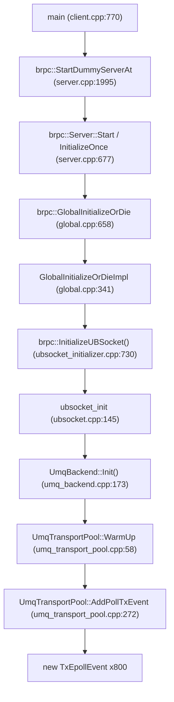

# UBSocket TX Event 启动期泄露分析 (TxEpollEvent)

> **现象**:ASan 报告
> ```
> Direct leak of 19200 byte(s) in 800 object(s) allocated from:
>     #1 ock::ubs::umq::UmqTransportPool::AddPollTxEvent(unsigned long) umq_transport_pool.cpp:250
>     #2 UmqTransportPool::WarmUp umq_transport_pool.cpp:58
>     #3 UmqBackend::Init() umq_backend.cpp:173
>     #4 ubsocket_init ubsocket.cpp:145
>     #5 brpc::InitializeUBSocket() ubsocket_initializer.cpp:730
>     ...
>     #14 main example/ub_test/client.cpp:770
> ```
> 本文从 `brpc/example/ub_test` 起逐帧追入 ubs-comm,定位泄露对象与缺失的释放路径。

## 1. 泄露类别

这是**启动期分配、进程退出未释放**的泄露——与 `UBSOCKET-UMQ-RX-LEAK-ANALYSIS.ch.md` 中的 RX 运行时增长泄露是**不同类别**。前者是退出清理缺失(对象恒定 800 个,19KB),后者是运行期持续丢失(对象随时间增长到 5GB)。两者机理与修复点均不同,需分开处理。

## 2. 调用栈解读(从 ub_test 入 ubs-comm)



**关键**:client 进程也会触发——`ub_test` client 在 `main` 调 `StartDummyServerAt(FLAGS_dummy_port)`(`client.cpp:770`),dummy server 走 brpc `Server::Start`,触发 `GlobalInitializeOrDie`→`InitializeUBSocket`→`ubsocket_init`,与真正 server 走**同一条** ubsocket 初始化链。因此 ASan 报告出现在 `ub_test_client` 进程。

## 3. 泄露对象与规模

- **对象**:`UmqTpTxEpollRunnerOps::TxEpollEvent`(`umq_tp_tx_epoll_runner_ops.h:27-31`):

  ```cpp
  struct TxEpollEvent {
      uint64_t type;         // RUNNER_EVENT_TYPE_TP_TX / RUNNER_EVENT_TYPE_FC_TX
      uint64_t umq_handle;
      uint32_t tp_idx;
  };
  ```
  布局 = 8 + 8 + 4 = 20 字节,`new` 按 8 字节对齐补齐到 **24 字节/个**。

- **数量**:800 个 = `UmqSetting::UMQ_TP_POOL_SIZE`(默认 800,`umq_setting.h:79`)。

- **总量**:800 × 24 = **19200 字节**,与 ASan 报告完全吻合(19200 / 800 = 24)。

## 4. 分配点

`UmqTransportPool::AddPollTxEvent`(`umq_transport_pool.cpp:263-288`,ASan 报告的 line 250 与本仓库版本行号差异是版本漂移,函数与分配语句一致):

```cpp
Result UmqTransportPool::AddPollTxEvent(uint64_t umq_handle)
{
    Locker lock(mutex_);
    EpollRunnerBase &epoll_runner = EpollRunnerFactory::GetInstance(EpollRunnerType::TRANSPORT_POOL_TX_RUNNER);
    for (const auto &tp_pair : umq_tp_pool[umq_handle]) {     // 遍历 800 个 TP
        uint32_t tp_idx = tp_pair.first;
        const auto &fd_vec = tp_pair.second;

        // 当前Jetty与fd是一对一关系，取第一个即可
        UmqTpTxEpollRunnerOps::TxEpollEvent *tx_epoll_event =
            new UmqTpTxEpollRunnerOps::TxEpollEvent{RUNNER_EVENT_TYPE_TP_TX, umq_handle, tp_idx};  // ← 泄露分配
        struct epoll_event umq_tx_event {};
        umq_tx_event.events = EPOLLIN | EPOLLET;
        umq_tx_event.data.u64 = reinterpret_cast<uintptr_t>(tx_epoll_event);

        UmqTpTxEpollRunnerOps::TpTxExtContext ctx;
        ctx.umq_handle = umq_handle;
        ctx.tp_idx = tp_idx;
        if (UNLIKELY(epoll_runner.AddEpollEvent(fd_vec[0], &umq_tx_event, &ctx))) {
            return UBS_ERROR;
        }
    }
    return UBS_OK;
}
```

800 个 TP 由 `CreatePool`(`umq_transport_pool.cpp:74-84`)循环 `pool_size` 次调 `CreateOneTp` 预创建,每个 TP 通过 `umq_interrupt_fd_get` 取一个 TX 中断 fd 存入 `umq_tp_pool[umq_handle][tp_idx]`。`AddPollTxEvent` 随后为每个 TP `new` 一个 `TxEpollEvent`。

`AddEventToRunner`(`umq_tp_tx_epoll_runner_ops.cpp:84-115`)把 `TxEpollEvent*` 存进 runner 的 `socket_data_` map:

```cpp
TxEpollEvent *tx_epoll_event = reinterpret_cast<TxEpollEvent *>(static_cast<uintptr_t>(event->data.u64));
InsertSocketEventData(fd, tx_epoll_event);   // socket_data_[fd] = tx_epoll_event  (umq_tp_tx_epoll_runner_ops.h:93)
```

## 5. 唯一释放路径(且退出时未走)

`TxEpollEvent` 的唯一 `delete` 在 `RemoveSocketEventData`(`umq_tp_tx_epoll_runner_ops.h:67-79`),只被 `DelEpollEvent`(`umq_tp_tx_epoll_runner_ops.cpp:117-129`)调用:

```cpp
int UmqTpTxEpollRunnerOps::DelEpollEvent(int epoll_fd, int fd) {
    auto ret = epoll_ctl(epoll_fd, EPOLL_CTL_DEL, fd, nullptr);
    if (UNLIKELY(ret < 0)) { ... return UBS_ERROR; }
    {
        Locker sLock(mutex_);
        RemoveSocketEventData(fd);   // ← delete tx_epoll_event
    }
    return UBS_OK;
}
```

```cpp
ALWAYS_INLINE bool RemoveSocketEventData(int fd) noexcept {
    auto pos = socket_data_.find(fd);
    if (UNLIKELY(pos == socket_data_.end())) { return false; }
    auto removed = pos->second;
    socket_data_.erase(pos);
    if (removed != nullptr) { delete removed; }   // ← 唯一 delete
    return true;
}
```

**问题:退出时没有任何代码对这 800 个 TP fd 调 `DelEpollEvent`。**

## 6. 三条潜在清理路径全部缺失

| 清理路径 | 是否释放 TxEpollEvent | 说明 |
|---------|----------------------|------|
| `ubsocket_uninit`(`ubsocket.cpp:208-246`) | ❌ | 只 `TxCqePoller::Stop()` + `ArraySet::ReleaseAll` + 三个 runner `Stop()`(join 线程) + `UmqBackend::UnInit`。**不调 `UmqTransportPool::Clean()`,也不对 TP fd 调 `DelEpollEvent`。** |
| `UmqBackend::UnInit`(`umq_backend.cpp:196-215`) | ❌ | 只 `umq_uninit()` + perf stop,无 transport pool 清理。 |
| `UmqTransportPool::Clean`(`umq_transport_pool.cpp:86-110`) | ❌ | 只 `umq_transport_pool_resource_modify/destroy`(释放 libumq 侧 tp 资源) + `umq_tp_pool.clear()`。**不调 `DelEpollEvent`,且 `TxEpollEvent*` 归 runner 的 `socket_data_` 所有,不归 `umq_tp_pool`**。而且 `Clean()` 仅在 `WarmUp` 失败时被调(`:53,61,68`),正常退出根本不调。 |

## 7. 为何 ASan 必报(双重保障缺失)

1. **LeakySingleton 不析构**:`EpollRunner<TRANSPORT_POOL_TX_RUNNER>` 是 LeakySingleton(`ubsocket_event_epoll.h:275+`),进程退出不析构。其成员 `UmqTpTxEpollRunnerOps` 持 `socket_data_` map(800 个 `TxEpollEvent*`),既无主动 `DelEpollEvent` 清理,又不会经析构释放 → 800 个对象活到进程退出 → ASan "direct leak"。

2. **`UmqTpTxEpollRunnerOps` 析构本身也漏 `socket_data_`**(`umq_tp_tx_epoll_runner_ops.h:37-40`):
   ```cpp
   ~UmqTpTxEpollRunnerOps() {
       LockRegistry::LOCK_OPS.destroy(mutex_);
   }   // 不 free socket_data_ 的 TxEpollEvent*
   ```
   即便 runner 真被销毁,这个析构也漏。双重保障全缺。

## 8. 触发条件

`WarmUp` 走 `CreatePool` + `AddPollTxEvent` 需同时满足(`umq_transport_pool.cpp:35-37` + `umq_backend.cpp:155`):

| 条件 | 取值 | 来源 |
|------|------|------|
| `LINK_SELECTION_POLICY == BONDING_BACKUP` | `UMQ_IS_BONDING=true` 且 `UBS_BACKUP_LINK_ENABLED=true` | `umq_backend.cpp:107-110,155` |
| `UMQ_UB_TP_MODE == UMQ_TM_RM` | `UB_TRANS_MODE` ∈ {RM_TP, RM_CTP} | `umq_setting.cpp:194-203` |
| `UMQ_TP_TYPE == POOL` | `UBSOCKET_JETTY_TYPE=pool`(默认) | `umq_setting.cpp:168-174` |

三者同时成立时,client(dummy server 触发 init)与真正 server 都会分配 800 个 `TxEpollEvent`。

## 9. 次要泄露:RebuildTp 也不 DelEpollEvent

`UmqTransportPool::RebuildTp`(`umq_transport_pool.cpp:221-251`)在 tp 异常重建时:`tp_map.erase(tp_pair)` + `CreateOneTp`(新 fd + 新 `TxEpollEvent`)。但:

- 旧 fd 在 runner 的 epoll 里**仍注册着**
- `socket_data_` 里的旧 `TxEpollEvent*` **未 `DelEpollEvent`**

每次 tp rebuild 泄露一个 `TxEpollEvent` + 残留一个 epoll 注册项。长期运行 + 频繁容灾切换(光组网 port 故障)会累积。这是同根问题的**运行期变体**,与启动期 800 个泄露共用修复方案。

## 10. 修复方案

根因:`TxEpollEvent` 的所有权(runner 的 `socket_data_`)与释放路径(`DelEpollEvent`)在退出/重建时未对齐。按优先级:

### 方案 1【必须,主修】`ubsocket_uninit` 退出前清理 transport pool 的 TX 事件

在 `ubsocket.cpp:208-246` 的 `ubsocket_uninit` 里,在 `EpollRunnerFactory::GetInstance(TRANSPORT_POOL_TX_RUNNER).Stop()` **之前**(顺序陷阱:`Stop()` 会置 `ops_=nullptr`,先于 Stop 才能调 `ops_->DelEpollEvent`)插入清理:

```cpp
void ubsocket_uninit()
{
    ...
    // 新增:清理 transport pool 的 TX 事件,释放 TxEpollEvent
    // 必须在 runner Stop() 之前(Stop 置 ops_=nullptr)且在 umq_uninit 之前(fd 来自 libumq)
    umq::UmqTransportPool::Instance().CleanTxBEvents();
    TxCqePoller::Instance().Stop();
    ArraySet<Socket>::GetInstance().ReleaseAll();
    ArraySet<EventPoll>::GetInstance().ReleaseAll();
    EpollRunnerFactory::GetInstance(SHARE_JFR_RX_RUNNER).Stop();
    EpollRunnerFactory::GetInstance(TRANSPORT_POOL_TX_RUNNER).Stop();
    EpollRunnerFactory::GetInstance(TRANSPORT_POOL_EVENT_RUNNER).Stop();
    umq::UmqBackend::UnInit();
}
```

`UmqTransportPool` 新增 `CleanTxBEvents()`:`umq_tp_pool` 持有 fd 列表(`TpIdx2FdMap`),遍历调 `EpollRunnerFactory::GetInstance(TRANSPORT_POOL_TX_RUNNER).DelEpollEvent(fd)`(内部 `RemoveSocketEventData` → `delete`)。

**顺序约束**:`CleanTxBEvents` → runner `Stop` → `umq_uninit`。`DelEpollEvent` 内 `epoll_ctl(DEL)` 操作 runner 自建 epoll_fd(不依赖 libumq),但 fd 本身来自 `umq_interrupt_fd_get`,libumq 释放后 fd 失效——故必须 `umq_uninit` 之前。

### 方案 2【必须,辅修】`UmqTransportPool::Clean()` 补 DelEpollEvent

`umq_transport_pool.cpp:86-110` 的 `Clean()` 在 destroy libumq 资源前,先对每个 fd 调 `DelEpollEvent`(同方案 1 的遍历)。这样 `WarmUp` 失败路径(`Clean()` 被调)也能正确释放,且与方案 1 共用遍历逻辑。

### 方案 3【建议】RebuildTp 释放旧 fd 的 TxEpollEvent

`umq_transport_pool.cpp:221-251` 的 `RebuildTp` 在 `tp_map.erase(tp_pair)` 前,对旧 fd 调 `EpollRunnerFactory::GetInstance(TRANSPORT_POOL_TX_RUNNER).DelEpollEvent(old_fd)`,再 destroy libumq 资源、`CreateOneTp`。堵运行期 rebuild 泄露(§9)。

### 方案 4【防御】`UmqTpTxEpollRunnerOps` 析构兜底 free `socket_data_`

`umq_tp_tx_epoll_runner_ops.h:37-40` 析构函数补:

```cpp
~UmqTpTxEpollRunnerOps()
{
    {
        Locker sLock(mutex_);
        for (auto &p : socket_data_) { delete p.second; }
        socket_data_.clear();
    }
    LockRegistry::LOCK_OPS.destroy(mutex_);
}
```

防御性兜底——即便上层漏调 `DelEpollEvent`,析构也能回收。但 LeakySingleton 不析构,此方案只在 runner 真被销毁的场景生效(如未来改为非 LeakySingleton)。主要靠方案 1。

## 11. 验证

修复后 ASan 重跑应无这 800 对象的报告。可用 `UMQ_TP_POOL_SIZE` 调小(如 8)验证:泄露量应按比例从 19200 降到 ~192(8×24),证明修复命中。

## 12. 关键代码位置索引

| 位置 | 作用 | 泄露相关性 |
|------|------|-----------|
| `umq_transport_pool.cpp:263-288` | `AddPollTxEvent` 遍历 800 TP | **分配点**(`new TxEpollEvent` @ 272-273) |
| `umq_tp_tx_epoll_runner_ops.cpp:96-97` | `AddEventToRunner` 存 `socket_data_[fd]` | 持有 `TxEpollEvent*` |
| `umq_tp_tx_epoll_runner_ops.h:93` | `socket_data_` map | LeakySingleton 不析构 |
| `umq_tp_tx_epoll_runner_ops.cpp:117-129` | `DelEpollEvent` | **唯一释放路径,退出未调** |
| `umq_tp_tx_epoll_runner_ops.h:67-79` | `RemoveSocketEventData` → `delete` | 唯一 `delete` |
| `umq_tp_tx_epoll_runner_ops.h:37-40` | 析构只销毁 mutex | 兜底也漏 |
| `ubsocket.cpp:208-246` | `ubsocket_uninit` | **不清理 transport pool TX 事件** |
| `umq_backend.cpp:196-215` | `UmqBackend::UnInit` | 无 transport pool 清理 |
| `umq_transport_pool.cpp:86-110` | `Clean()` | 只清 libumq 资源,不 `DelEpollEvent`,且仅失败路径调 |
| `umq_transport_pool.cpp:221-251` | `RebuildTp` | 次要泄露(旧 fd 不 DelEpollEvent) |
| `umq_transport_pool.cpp:35-37,58` | `WarmUp` 触发条件 | BONDING_BACKUP + RM + POOL |
| `umq_setting.h:79` | `UMQ_TP_POOL_SIZE=800` | 决定泄露对象数 |
| `umq_tp_tx_epoll_runner_ops.h:27-31` | `TxEpollEvent` 结构 | 24 字节/个 |

## 13. 与 RX 泄露的关系

| 维度 | 本泄露(TX Event) | RX 泄露(`UBSOCKET-UMQ-RX-LEAK-ANALYSIS.ch.md`) |
|------|------------------|------------------------------------------------|
| 类别 | 启动期分配,退出未释放 | 运行期持续丢失 |
| 对象 | `TxEpollEvent` × 800(恒定) | `umq_buf_t` × 持续增长 |
| 规模 | 19KB(不增长) | 涨到 5GB 上限 |
| 触发 | BONDING_BACKUP+RM+POOL 配置即触发 | 高负载下 per-socket 队列满触发 |
| 根因 | 退出清理路径缺失(`DelEpollEvent` 未调) | 运行期 `AddQbuf` 失败不 `umq_buf_free` |
| 修复点 | `ubsocket_uninit` + `Clean()` + `RebuildTp` + 析构 | `AddQbuf`/`Enqueue` 失败兜底 free |
| 优先级 | 低(19KB,不影响功能) | 高(5GB 导致扩容失败、连接异常) |

两者**机理独立、修复点不重叠**,需分别修复。建议优先修 RX 泄露(影响运行),TX Event 泄露作为代码质量改进一并修。

## 参考

- `UBSOCKET-UMQ-RX-LEAK-ANALYSIS.ch.md` — RX 运行时增长泄露(5GB)
- `UBSOCKET-UMQ-ADAPTER-ANALYSIS.ch.md` — umq 适配层逐文件分析(含 `UmqTransportPool`、`UmqTpTxEpollRunnerOps`)
- `UBSOCKET-BRPC-UB-TEST-FLOW.ch.md` — brpc ub_test 端到端流程
- `UBSOCKET-ARCHITECTURE.ch.md` — 整体架构与 `EpollRunner`/LeakySingleton 说明
